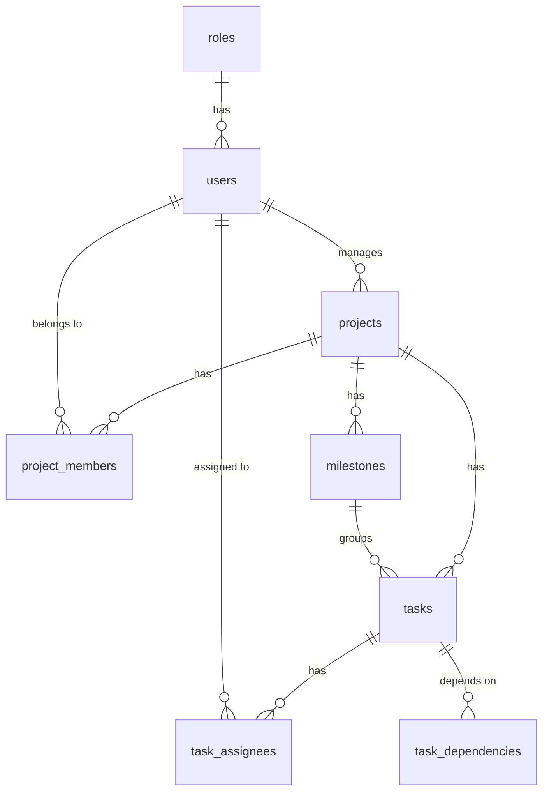

# Database

PostgreSQL schema and init scripts for the Task & Project Management System.

## Stack

- PostgreSQL 18 (via Docker locally; CI uses `postgres:16` as a throwaway test instance — see [ci.yml](../.github/workflows/ci.yml))
- Plain SQL init scripts (no migration tool yet — see [Migrations](#migrations) below)

## Running it locally

From the repo root:

```bash
cp .env.example .env   # first time only
docker compose up -d
```

This starts a `postgres` container, creates the `taskmanager` database, and runs every `.sql` file in [`database/init/`](init/) against it **the first time the container's data volume is created**. If you change a script after the volume already exists, it won't re-run automatically — see below.

Connection details (also the backend's defaults, in [backend/src/main/resources/application.properties](../backend/src/main/resources/application.properties)):

| | |
|---|---|
| Host | `localhost` |
| Port | `5432` |
| Database | `taskmanager` |
| User | `postgres` |
| Password | `postgres` |

### Re-running init scripts after a schema change

`docker-entrypoint-initdb.d` scripts only run against an empty data directory. To pick up changes to `01-init.sql` during development:

```bash
docker compose down -v   # drops the pgdata volume — local data only, safe in dev
docker compose up -d
```

### Inspecting the database

```bash
docker exec -it taskmanager-postgres psql -U postgres -d taskmanager
```

## Schema

Scope is the core tables needed for the main workflow (Register → Login → Create Project → Add Team → Create Milestones → Create Tasks → Assign → Track Progress). Comments, attachments, notifications, work logs, and activity logs from [Role_Requirment.md](../Role_Requirment.md) aren't modeled yet — add them as separate migrations when that work starts.



| Table | Purpose |
|---|---|
| `roles` | System-wide roles: Administrator, Project Manager, Team Leader, Team Member |
| `users` | Accounts — profile fields, credentials, one `role_id` |
| `projects` | Project ID, name, code, dates, manager, priority, status, progress |
| `project_members` | Who's on a project and their per-project role |
| `milestones` | Project phases with a due date and status |
| `tasks` | Work items — optionally under a milestone, with priority/status/dates/progress |
| `task_assignees` | Who a task is assigned to (many-to-many) |
| `task_dependencies` | "Task A can't start until Task B is completed" |

Conventions: `BIGINT GENERATED ALWAYS AS IDENTITY` primary keys, `created_at`/`updated_at` (auto-maintained via trigger) on mutable tables, enum-like fields as `VARCHAR` + `CHECK` rather than native Postgres enums (easier to extend later).

## Migrations

There's no migration tool wired in yet — `01-init.sql` is the whole schema, applied by Postgres itself on first container start. If the schema needs to evolve after data exists (e.g. once a `dev` deployment has real rows), introduce Flyway or Liquibase rather than hand-editing `01-init.sql`; add `02-*.sql`-style scripts here in the meantime for anything beyond local dev resets.

## Contributing

See the root [README](../README.md) and [Contributing.md](../Contributing.md) for branch naming (`database/<task>`) and PR workflow.
