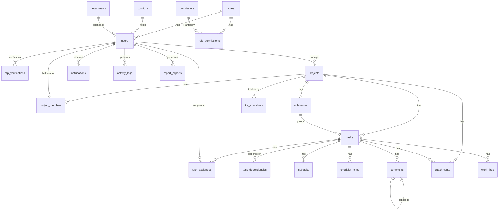

# Database

PostgreSQL schema and init scripts for the Task & Project Management System.

## Stack

- PostgreSQL 18 (via Docker locally; CI uses `postgres:16` as a throwaway test instance — see [ci.yml](../.github/workflows/ci.yml))
- Plain SQL init scripts are the actual source of truth for the schema; Flyway migrations are kept as a versioned historical record alongside them, not yet wired into how the app actually applies schema changes — see [Migrations](#migrations) below

## Running it locally

From the repo root:

```bash
cp .env.example .env   # first time only
docker compose up -d
```

This starts a `postgres` container, creates the `taskmanager` database, and runs every `.sql`/`.sh` file in [`database/init/`](init/) against it, in filename order, **the first time the container's data volume is created**. If you change a script after the volume already exists, it won't re-run automatically — see below.

[`01-init.sql`](init/01-init.sql) is the schema; [`02-seed.sql`](init/02-seed.sql) loads placeholder demo data (~13 users, 6 projects, and everything under them) on top of it so there's something to look at without registering accounts by hand — CI loads both files into its throwaway test database too (see [ci.yml](../.github/workflows/ci.yml)). [`03-app-role.sh`](init/03-app-role.sh) then creates the least-privileged role the backend actually connects as — see [Least-privilege application role](#least-privilege-application-role) below.

Every seeded user shares the password **`DevPassword123!`** — the bcrypt hash in the file is generated and verified specifically for that plaintext. `contractor.felix` (`INACTIVE`) and `exemployee.diego` (`SUSPENDED`) are seeded to deliberately fail login regardless of password, to exercise `account_status` handling.

Connection details:

| | Superuser (admin/migrations) | App role (what the backend connects as) |
|---|---|---|
| Host | `localhost` | `localhost` |
| Port | `5432` | `5432` |
| Database | `taskmanager` | `taskmanager` |
| User | `postgres` | `taskmanager_app` |
| Password | `postgres` | `taskmanager_app_password` (dev default — set via `TASKMANAGER_APP_PASSWORD`) |

The backend's actual defaults live in [backend/src/main/resources/application.properties](../backend/src/main/resources/application.properties) (`SPRING_DATASOURCE_USERNAME`/`PASSWORD`, overridable via env — see `.env.example`/`docker-compose.yml`).

### Re-running init scripts after a schema change

`docker-entrypoint-initdb.d` scripts only run against an empty data directory. To pick up changes to `01-init.sql` during development:

```bash
docker compose down -v   # drops the pgdata volume — local data only, safe in dev
docker compose up -d
```

### Inspecting the database

```bash
docker exec -it taskmanager-postgres psql -U postgres -d taskmanager
```

## Schema

Covers the full Database scope from [Role_Requirment.md](../Role_Requirment.md): the core workflow tables (Register → Login → Create Project → Add Team → Create Milestones → Create Tasks → Assign → Track Progress) plus subtasks/checklists, comments, attachments, work logs, notifications, activity logs, role-level permissions, and report/KPI persistence.



| Table | Purpose |
|---|---|
| `roles` | Only two rows exist: `USER` (default for every self-registered account, no special access) and `ADMINISTRATOR` (global bypass + user/role management). Real project/task authority comes from `project_members.project_role`, not this table — see [Authorization](#authorization--permissions) below |
| `permissions` | Flat catalog of actions: View, Create, Edit, Delete, Assign, Approve, Generate Reports |
| `role_permissions` | Default permission matrix — which roles have which permissions (see [Authorization](#authorization--permissions) below) |
| `positions` | Org-wide job-title lookup list (e.g. "Software Engineer"), Team-Admin-managed |
| `departments` | Org-wide department lookup list, same shape as `positions` |
| `users` | Accounts — profile fields, credentials, one `role_id`, optional `position_id`/`department_id` |
| `otp_verifications` | Bcrypt-hashed one-time codes for self-registration email verification — capped attempts, expiring, one active code per user at a time |
| `projects` | Project ID, name, code, dates, manager, priority, status, progress |
| `project_members` | Who's on a project, their per-project `project_role` (`OWNER`/`ADMIN`/`MEMBER`/`VIEWER`), and invitation state (`status`: `PENDING`/`ACTIVE`/`DECLINED`, `invited_by`, `responded_at`) |
| `milestones` | Project phases with a due date and status |
| `tasks` | Work items — optionally under a milestone, with priority/status/dates/progress |
| `task_assignees` | Who a task is assigned to (many-to-many) |
| `task_dependencies` | "Task A can't start until Task B is completed" |
| `subtasks` | Smaller work items under a task, each with its own assignee/due date/status |
| `checklist_items` | Lightweight todo items inside a task (no assignee/due date, just done-or-not) |
| `comments` | Task discussion, with optional `parent_comment_id` for replies |
| `attachments` | A file on exactly one of a project or a task |
| `work_logs` | Hours a user logged against a task, on a given date |
| `notifications` | Per-user alerts (task assigned, status changed, deadline, overdue, etc.) |
| `activity_logs` | Audit trail of who did what, when, on which project/task |
| `report_exports` | Metadata for a generated/exported report file (PDF/Excel prototype) |
| `kpi_snapshots` | Point-in-time KPI values per project (or org-wide), for trend history |

Plus derived views that aren't stored data — see [Progress, overdue detection, and reports](#progress-overdue-detection-and-reports) below: `v_overdue_tasks`, `v_project_status_summary`, `v_task_completion_by_project`, `v_team_performance`, `v_team_workload`.

Conventions: `BIGINT GENERATED ALWAYS AS IDENTITY` primary keys, `created_at`/`updated_at` (auto-maintained via trigger) on mutable tables, enum-like fields as `VARCHAR` + `CHECK` rather than native Postgres enums (easier to extend later).

### Deliberate design decisions worth recording

A couple of choices that came up as ambiguous or under-specified while implementing this schema, resolved and recorded here so they aren't re-litigated later:

- **Account status values.** `Role_Requirment.md` names "Account Status" as a field but never enumerates its values. The schema uses `users.account_status IN ('ACTIVE', 'INACTIVE', 'SUSPENDED', 'PENDING_VERIFICATION')` — `SUSPENDED` is the established name in this codebase and is kept as-is by deliberate choice. `PENDING_VERIFICATION` was added alongside self-registration (`V3__add_registration_otp_and_preferences.sql`) — the state a self-registered account sits in until it completes OTP email verification; `login` treats it the same as any other non-`ACTIVE` status (rejected).
- **Task assignment cardinality.** A task "may have one or more assignees depending on the application design" (per `Role_Requirment.md`) — the schema keeps assignment optional. A `tasks` row can exist with zero `task_assignees` rows, the same way a GitHub issue can exist unassigned and be assigned later. No DB-level "at least one assignee" constraint exists.

### Authorization / permissions

`permissions` + `role_permissions` were originally built as Role_Requirment.md's action list (View, Create, Edit, Delete, Assign, Approve, Generate Reports) applied as a flat, **role-level** matrix across four global roles. That model doesn't exist anymore — `V5__project_scoped_authorization.sql` dropped `PROJECT_MANAGER`/`TEAM_LEADER`/`TEAM_MEMBER` from `roles` entirely, so `role_permissions` today only ever has rows for `ADMINISTRATOR` (all 7 permissions); `USER` (added by `V7`, assigned to every self-registered account) has none — it's a pure account-level label, not a permission grant.

Real project/task authorization now comes from `project_members.project_role` — `OWNER` / `ADMIN` / `MEMBER` / `VIEWER`, scoped to that one project row, not this global table — checked in application code (`ProjectAccessGuard`, see [backend/README.md](../backend/README.md#security)) rather than looked up from `role_permissions` at all. The `permissions`/`role_permissions` tables still exist and are still correctly seeded for `ADMINISTRATOR`, but they're vestigial for anything project-scoped now — a resource-scoped permission table (`project_role` × `permission`) would be the natural next step if finer-than-`OWNER`/`ADMIN`/`MEMBER`/`VIEWER` grants are ever needed.

Nothing in the backend consumes `role_permissions` (confirmed: authorization is either `@PreAuthorize("hasRole(...)")` for the handful of genuinely global actions, or `ProjectAccessGuard`'s `if` checks against `project_members.project_role` for everything else). Wiring either path to a data-driven permissions table instead of hardcoded checks is still an open follow-up.

### Least-privilege application role

The backend doesn't connect as the Postgres superuser (`POSTGRES_USER`/`postgres`) — [`init/03-app-role.sh`](init/03-app-role.sh) creates a dedicated `taskmanager_app` role that the backend uses instead, so a compromised or buggy application process can't touch anything beyond what it actually needs:

- `SELECT`/`INSERT`/`UPDATE`/`DELETE` on the 15 tables the backend's JPA entities actually touch (`roles`, `users`, `positions`, `departments`, `otp_verifications`, `projects`, `project_members`, `milestones`, `tasks`, `subtasks`, `comments`, `task_assignees`, `task_dependencies`, `notifications`, `activity_logs`) — not the other 7 tables, which have no backend code touching them yet.
- `USAGE`/`SELECT` on every sequence in the `public` schema — required because `GENERATED ALWAYS AS IDENTITY` primary keys still back onto a real Postgres sequence, and a non-owner role needs sequence `USAGE` for the implicit `nextval()` call an `INSERT` triggers (a well-known "permission denied for sequence ..._id_seq" gotcha if skipped).
- No `SUPERUSER`, `CREATEDB`, or `CREATEROLE` — it can't alter the schema, create other roles, or touch other databases.
- Explicit (if largely redundant, since Postgres grants `EXECUTE` on new functions to `PUBLIC` by default and nothing here revokes that) `EXECUTE` grants on `fn_compute_project_progress`/`fn_compute_milestone_progress`/`fn_generate_overdue_notifications`.

**Adding a table's backend entity later needs a matching `GRANT` line added to `init/03-app-role.sh`** (and, in principle, to the equivalent step in [ci.yml](../.github/workflows/ci.yml), which duplicates this script's grants rather than sourcing it, since CI talks to a bare service container rather than through the `postgres` Docker image's own init-script mechanism). **These two have already drifted apart**: `ci.yml`'s grant step currently only covers 10 tables (`roles`, `users`, `projects`, `project_members`, `milestones`, `tasks`, `task_assignees`, `task_dependencies`, `notifications`, `otp_verifications`), missing the 5 that `03-app-role.sh` grants for `positions`/`departments`/`subtasks`/`comments`/`activity_logs` — harmless today only because no controller/repository test yet touches those tables in CI (see backend/README.md's Unit tests status), but a real gap to close before adding one. Grants only take effect against a fresh volume locally — `docker compose down -v && docker compose up -d`.

### Progress, overdue detection, and reports

- **`projects.progress` / `milestones.progress` are derived, not authoritative.** Both stay ordinary writable `NUMERIC` columns (existing API contract unchanged), but two triggers keep them from ever going stale:
  - `trg_tasks_progress_sync` (`AFTER INSERT/UPDATE/DELETE` on `tasks`) recomputes the task's project and milestone every time a task is created, changes status, moves between projects/milestones, or is deleted.
  - `trg_projects_progress_derived` / `trg_milestones_progress_derived` (`BEFORE UPDATE` on `projects`/`milestones`) recompute and silently overwrite `NEW.progress` on **every** update to that row, so even a direct `PUT`/manual `UPDATE` that sends an arbitrary progress value gets corrected before it's persisted.
  - The formula (`fn_compute_project_progress` / `fn_compute_milestone_progress`): `100 * completed_tasks / total_tasks`, where both counts exclude `CANCELLED` tasks (cancelled work isn't remaining project work, and shouldn't drag progress down either). Zero tasks → 0%.
  - Side effect worth knowing: because the task-change path recomputes via a real `UPDATE` on the parent row, a project's/milestone's `updated_at` bumps whenever any of its tasks change, not just when you edit the project/milestone directly.
- **Overdue is a derived state, not a stored status.** `v_overdue_tasks` is a view (`due_date < CURRENT_DATE AND status NOT IN ('COMPLETED','CANCELLED')`), always current, nothing to keep in sync. `fn_generate_overdue_notifications()` inserts one `OVERDUE_TASK` notification per overdue task per current assignee, deduped **per calendar day** (not per read-status) — so a task overdue for a week produces one notification per assignee per day, not one ever or one per call. Nothing calls this function on a schedule yet; wiring a daily caller (a Spring `@Scheduled` job, `pg_cron`, etc.) is a backend/deployment follow-up.
- **Reports are mostly derived live, not stored.** `v_project_status_summary`, `v_task_completion_by_project`, `v_team_performance`, and `v_team_workload` cover the Project Status, Task Completion, Team Performance, and Workload reports directly from existing tables. `report_exports` persists metadata about an actually-generated/exported report file (PDF/Excel prototype); `kpi_snapshots` persists point-in-time KPI values (`project_completion_rate`, `task_completion_rate`, `overdue_rate`, `average_task_completion_time`, `on_time_completion_rate` — the exact 5 metrics both requirement docs list under KPIs) so a KPI trend chart has history — neither is auto-populated by a trigger; both are meant to be written by whatever backend job/endpoint eventually generates reports or takes daily KPI snapshots.

### Task integrity rules

- **A task's `start_date` and `due_date` are required** (`NOT NULL`) — Role_Requirment.md treats both as mandatory, not optional.
- **A dependent task can't become active while its dependency is incomplete**, enforced from both directions since either write path can create the same invalid state: `trg_tasks_dependencies_status_gate` (on `tasks`) blocks a task's own status moving to `IN_PROGRESS`/`IN_REVIEW`/`COMPLETED` while a `task_dependencies` row points at an incomplete prerequisite; `trg_task_dependencies_status_gate` (on `task_dependencies`) blocks the reverse — wiring a new dependency onto a task that's already active, pointing at a prerequisite that isn't `COMPLETED`. `TO_DO` and `CANCELLED` are always allowed regardless of dependency state.
- **A task's milestone must belong to the task's own project** (`trg_tasks_milestone_project_match`) — a task under Project A can't be attached to a milestone from Project B.
- **A task assignee must be a member of the task's project** (`trg_task_assignees_project_member`).
- **A task assignee's account must be `ACTIVE`** (`trg_task_assignees_not_suspended`) — a `SUSPENDED`/`INACTIVE` user can't receive a new active-work assignment.
- **A task can't become `COMPLETED` while it has an incomplete subtask** (`trg_tasks_not_completed_with_open_subtasks`, `BEFORE UPDATE` on `tasks`) — one-directional: it only blocks the transition *into* `COMPLETED`, and never reaches back to un-complete an already-`COMPLETED` task if a subtask is reopened afterward. A task's own `progress` is also kept in sync with its subtasks' completion ratio (`trg_subtasks_sync_parent_task`, `trg_tasks_progress_derived_from_subtasks`) — same derived-not-authoritative pattern as project/milestone progress, but neither trigger ever touches `status`. Task status otherwise stays entirely manual/independent of subtask completion by design — see `backend/README.md`'s [Task & Subtask Rules](../backend/README.md#task--subtask-rules) for the one deliberate exception, an application-layer (not DB) auto-promotion from `TO_DO` to `IN_PROGRESS`.

### Verifying invariants

[`verify_invariants.sql`](verify_invariants.sql) is a standalone script of 7 read-only queries — each expected to return **zero rows** on a healthy database — that double-check the rules above actually hold (missing dates, an active task with an incomplete dependency, a non-member/suspended assignee, a cross-project milestone link, stale project/milestone progress). Run it any time with `psql -f database/verify_invariants.sql`, especially after a schema or seed change.

**Wired into CI**: [ci.yml](../.github/workflows/ci.yml)'s backend job runs this script (via `psql -t -A`, which prints nothing when every query is empty) right after loading the schema/seed, and fails the build if it prints anything at all — so a PR that introduces one of these violations (in a trigger, in seed data, wherever) is caught before `mvn verify` even runs.

### Business rules enforced at the DB level

A few rules from the requirements doc are cross-row or cross-table, so a column `CHECK` can't express them — these are enforced with triggers instead:

- **`users.username` / `users.email` uniqueness is case-insensitive** (`idx_users_username_lower`, `idx_users_email_lower`) — login accepts "Username or Email", so `Nikky` and `nikky` must not be treated as different accounts.
- **`tasks.completed_at` is auto-managed** (`trg_tasks_completed_at`) — set the moment `status` becomes `COMPLETED`, cleared if the task is reopened, so a completed task can never be missing its completion date.
- **`tasks.due_date` can't be later than its project's `end_date`** (`trg_tasks_due_date_within_project`).
- **`milestones.due_date` must fall within its project's `start_date`/`end_date`** (`trg_milestones_due_date_within_project`).
- **`task_dependencies` can't form a cycle** (`trg_task_dependencies_no_cycle`) — A depends-on B depends-on A (or any longer loop) would mean none of those tasks could ever start, since a dependency requires the depended-on task to be `COMPLETED` first.
- **A dependent task can't go active while incomplete** (`trg_tasks_dependencies_status_gate` on `tasks`, `trg_task_dependencies_status_gate` on `task_dependencies`) — see [Task integrity rules](#task-integrity-rules) above.
- **A task's milestone must belong to the task's project** (`trg_tasks_milestone_project_match`).
- **A task assignee must be a project member and `ACTIVE`** (`trg_task_assignees_project_member`, `trg_task_assignees_not_suspended`).
- **`projects.progress` / `milestones.progress` are kept in sync with task completion** (`trg_tasks_progress_sync`, `trg_projects_progress_derived`, `trg_milestones_progress_derived`) — see [Progress, overdue detection, and reports](#progress-overdue-detection-and-reports) above.
- **A task can't become `COMPLETED` with an open subtask, and a task's own `progress` is kept in sync with its subtasks** — see [Task integrity rules](#task-integrity-rules) above.

Every `RAISE EXCEPTION` in a validation trigger sets `USING ERRCODE = '23514'` (check_violation) explicitly. Without it, Postgres defaults to `P0001`, which isn't in the SQLSTATE class (`23`) that Hibernate/Spring translate into a clean `DataIntegrityViolationException` — the error instead fell through the backend's exception handling as an unclassified 500 with no useful message, which is exactly what happened before this was added. **If you add a new cross-row/cross-table check as a trigger, set this on its `RAISE EXCEPTION` too**, or its violations won't surface as a proper 400 to API clients. (The progress-sync triggers are the one exception — they never raise; they only recompute a value.)

### API / backend coverage

Not every table here has a backend entity, repository, service, and controller yet — some are DB-only, reachable from `psql` but not from the API. As of this pass:

| Table | Backend coverage |
|---|---|
| `notifications` | Full stack (entity, repository, service, controller) |
| `positions` / `departments` | Full stack — org-wide lookup lists, Team-Admin-managed (see `backend/README.md`'s Security section) |
| `otp_verifications` | Full stack, but no direct REST surface of its own — consumed only by `AuthController`'s `register`/`verify-otp`/`resend-otp` |
| `subtasks` | Full stack — project-membership-scoped (`ProjectAccessGuard`) |
| `comments` | Full stack — project-membership-scoped for read/create, author-only edit, author-or-team-admin delete |
| `activity_logs` | Full stack — read-only API (`GET /api/activity-logs/task/{taskId}`), written internally by other services rather than posted to directly (see `backend/README.md`'s Task & Subtask Rules / Notifications sections) |
| `checklist_items` | DB-only — no entity/repository/service/controller |
| `attachments` | DB-only — no entity/repository/service/controller |
| `work_logs` | DB-only — no entity/repository/service/controller |
| `permissions` / `role_permissions` | DB-only — nothing in the backend consults these yet (see [Authorization](#authorization--permissions) above) |
| `report_exports` / `kpi_snapshots` | DB-only — nothing writes to these yet; the reporting *views* are queryable but have no controller either |

`project_members` also gained a `status`/`invited_by`/`responded_at` trio (see `V4__add_team_invitations_positions_departments_subtasks_comments.sql`) to support the team-invitation workflow — a `project` IS the "team" in this app's data model, so there's no separate `teams` table.

Remaining scope for a future pass: entities/controllers/services for the three still-DB-only feature tables above (`checklist_items`, `attachments`, `work_logs`), wiring the backend to `role_permissions`, and adding endpoints over the reporting views/`report_exports`/`kpi_snapshots`.

## Migrations

**Source of truth, stated plainly:** `database/init/*.sql` is what actually creates the schema — Docker Compose (`docker-entrypoint-initdb.d`) and CI both run `01-init.sql` then `02-seed.sql` directly, every time. `database/taskmanager/migrations/` is a **parallel, versioned historical record** of the same schema, kept logically equivalent by hand — not the thing that executes today. If you only remember one sentence from this section: editing `init/01-init.sql` without also adding a matching Flyway migration (or vice versa) is how the drift this project had before gets reintroduced.

Managed with **Flyway Desktop** (Redgate) as project `taskmanager`, living at [`taskmanager/`](taskmanager/):

```
database/taskmanager/
├── flyway.toml              (project config — databaseType = "PostgreSql")
├── flyway.user.toml         (per-user Development/Shadow connection details — gitignored, never commit)
├── filter.rgf                (SQL Compare filter, used by Flyway Desktop's diffing)
├── schema-model/             (schema snapshot Flyway Desktop maintains from the Development connection)
└── migrations/
    ├── V1__initial_schema.sql                                    (baseline)
    ├── V2__add_permissions_progress_and_integrity_rules.sql      (permissions, derived progress, dependency/assignment/consistency rules, overdue detection, reporting views — see this file's own header)
    ├── V3__add_registration_otp_and_preferences.sql              (self-registration OTP, theme/notification preferences)
    ├── V4__add_team_invitations_positions_departments_subtasks_comments.sql  (positions/departments lookup tables, project_members invitation workflow, notifications.type additions — see this file's own header)
    ├── V5__project_scoped_authorization.sql                      (users.role_id becomes optional/system-admin-only; project_members.project_role vocabulary becomes OWNER/ADMIN/MEMBER/VIEWER; obsolete PROJECT_MANAGER/TEAM_LEADER/TEAM_MEMBER global roles dropped — see this file's own header)
    ├── V6__store_profile_photo_in_database.sql                   (users.profile_photo_url replaced by profile_photo/profile_photo_content_type/profile_photo_token, storing the photo bytes in the row instead of on local disk — see this file's own header)
    ├── V7__add_default_global_user_role.sql                      (adds the USER system role, assigned by default to every self-registered account — no permission bypass, purely an account-level label; see this file's own header)
    └── V8__enforce_project_owner_integrity.sql                   (trigger refusing to demote/remove/cascade-delete a project's last active OWNER, so a project can never end up ownerless; see this file's own header)
```

From here on, schema changes should be new `V7__*.sql` files in `taskmanager/migrations/` — never edits to an already-numbered migration, since Flyway checksums each applied file and refuses to re-run one that changed underneath it. (V1 itself was corrected in place once, as part of this change, to fix three of its triggers that were silently missing `USING ERRCODE = '23514'` — see [Business rules](#business-rules-enforced-at-the-db-level) above. That's normally not allowed; it was safe here specifically because no `flyway_schema_history` table has ever existed anywhere this project runs, so nothing had actually consumed V1's checksum yet. Don't treat this as precedent for editing a migration that's actually been applied somewhere.) Flyway Desktop can generate new migrations for you by diffing its **Development** environment against its **Shadow** environment (a second, disposable Postgres database it can freely wipe/rebuild — create one locally with `docker exec -it taskmanager-postgres psql -U postgres -c "CREATE DATABASE taskmanager_shadow;"` if you're setting the project up fresh).

Note V2 expresses the same changes as `ALTER TABLE`/`CREATE` statements against the V1 baseline (e.g. `ALTER TABLE tasks ALTER COLUMN start_date SET NOT NULL`), whereas `01-init.sql` bakes them straight into each `CREATE TABLE` (e.g. `start_date DATE NOT NULL`) since it always runs against an empty database — same resulting schema, different route to it. Verified directly: applying `01-init.sql` and applying `V1` then `V2` against two fresh disposable databases produces identical table/view/trigger sets.

**This isn't wired up to run automatically yet.** `init/01-init.sql` is still what actually creates the schema locally (via `docker-entrypoint-initdb.d`) and in CI. Making Flyway the thing that actually applies migrations to a real deploy target means either adding `flyway-core` as a backend dependency (so Spring Boot runs pending migrations on startup — pairs naturally with the backend's existing `ddl-auto=validate`) or a Flyway CLI/Docker step in `docker-compose.yml`. Both touch files outside this folder, so that's a deliberate follow-up.

In the meantime, anyone without Flyway Desktop installed can still run/inspect the same migrations via the plain CLI or Docker image, since `flyway.toml` is the standard Flyway config format regardless of which tool reads it:

```powershell
docker run --rm `
  -v "${PWD}\database\taskmanager\migrations:/flyway/sql" `
  -e FLYWAY_URL="jdbc:postgresql://host.docker.internal:5432/taskmanager" `
  -e FLYWAY_USER=postgres `
  -e FLYWAY_PASSWORD=postgres `
  -e FLYWAY_BASELINE_ON_MIGRATE=true `
  -e FLYWAY_BASELINE_VERSION=0 `
  flyway/flyway info
```

(`host.docker.internal` reaches the host's published `5432` port from inside the Flyway container on Docker Desktop for Windows/Mac. `FLYWAY_BASELINE_ON_MIGRATE` matters because the docker-compose Postgres already has this schema from `init/01-init.sql` — it tells Flyway to adopt that existing state as V1 instead of erroring that the tables already exist.)

Migrations only ever contain schema, not demo data — `init/02-seed.sql` is dev-only fake data and deliberately isn't a Flyway migration, since migrations are meant to be safe to run in every environment. Run it by hand (`psql -f database/init/02-seed.sql`) after migrating if you want the demo rows.

## Contributing

See the root [README](../README.md) and [Contributing.md](../Contributing.md) for branch naming (`database/<task>`) and PR workflow.
