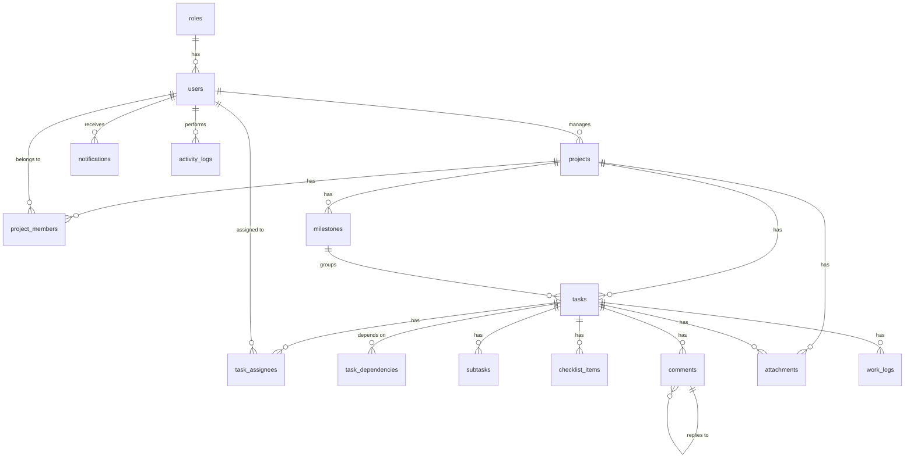

# Database

PostgreSQL schema and init scripts for the Task & Project Management System.

## Stack

- PostgreSQL 18 (via Docker locally; CI uses `postgres:16` as a throwaway test instance — see [ci.yml](../.github/workflows/ci.yml))
- Plain SQL init scripts (no migration tool yet — see [Migrations](#migrations) below)

## Running it locally

From the repo root:

```bash
cp .env.example .env   # first time only
docker compose up -d
```

This starts a `postgres` container, creates the `taskmanager` database, and runs every `.sql` file in [`database/init/`](init/) against it **the first time the container's data volume is created**. If you change a script after the volume already exists, it won't re-run automatically — see below.

[`01-init.sql`](init/01-init.sql) is the schema; [`02-seed.sql`](init/02-seed.sql) loads placeholder demo data (~13 users, 6 projects, and everything under them) on top of it so there's something to look at without registering accounts by hand. It's demo data only, not a fixture set for automated tests — CI loads both files into its throwaway test database too (see [ci.yml](../.github/workflows/ci.yml)).

Connection details (also the backend's defaults, in [backend/src/main/resources/application.properties](../backend/src/main/resources/application.properties)):

| | |
|---|---|
| Host | `localhost` |
| Port | `5432` |
| Database | `taskmanager` |
| User | `postgres` |
| Password | `postgres` |

### Re-running init scripts after a schema change

`docker-entrypoint-initdb.d` scripts only run against an empty data directory. To pick up changes to `01-init.sql` during development:

```bash
docker compose down -v   # drops the pgdata volume — local data only, safe in dev
docker compose up -d
```

### Inspecting the database

```bash
docker exec -it taskmanager-postgres psql -U postgres -d taskmanager
```

## Schema

Covers the full Database scope from [Role_Requirment.md](../Role_Requirment.md): the core workflow tables (Register → Login → Create Project → Add Team → Create Milestones → Create Tasks → Assign → Track Progress) plus subtasks/checklists, comments, attachments, work logs, notifications, and activity logs. Not modeled: a granular permissions table beyond the 4 fixed roles — role checks are expected to be coarse (`ADMINISTRATOR`/`PROJECT_MANAGER`/`TEAM_LEADER`/`TEAM_MEMBER`) rather than per-permission.



| Table | Purpose |
|---|---|
| `roles` | System-wide roles: Administrator, Project Manager, Team Leader, Team Member |
| `users` | Accounts — profile fields, credentials, one `role_id` |
| `projects` | Project ID, name, code, dates, manager, priority, status, progress |
| `project_members` | Who's on a project and their per-project role |
| `milestones` | Project phases with a due date and status |
| `tasks` | Work items — optionally under a milestone, with priority/status/dates/progress |
| `task_assignees` | Who a task is assigned to (many-to-many) |
| `task_dependencies` | "Task A can't start until Task B is completed" |
| `subtasks` | Smaller work items under a task, each with its own assignee/due date/status |
| `checklist_items` | Lightweight todo items inside a task (no assignee/due date, just done-or-not) |
| `comments` | Task discussion, with optional `parent_comment_id` for replies |
| `attachments` | A file on exactly one of a project or a task |
| `work_logs` | Hours a user logged against a task, on a given date |
| `notifications` | Per-user alerts (task assigned, status changed, deadline, etc.) |
| `activity_logs` | Audit trail of who did what, when, on which project/task |

Conventions: `BIGINT GENERATED ALWAYS AS IDENTITY` primary keys, `created_at`/`updated_at` (auto-maintained via trigger) on mutable tables, enum-like fields as `VARCHAR` + `CHECK` rather than native Postgres enums (easier to extend later).

### Business rules enforced at the DB level

A few rules from the requirements doc are cross-row or cross-table, so a column `CHECK` can't express them — these are enforced with `BEFORE INSERT OR UPDATE` triggers instead:

- **`users.username` / `users.email` uniqueness is case-insensitive** (`idx_users_username_lower`, `idx_users_email_lower`) — login accepts "Username or Email", so `Nikky` and `nikky` must not be treated as different accounts.
- **`tasks.completed_at` is auto-managed** (`trg_tasks_completed_at`) — set the moment `status` becomes `COMPLETED`, cleared if the task is reopened, so a completed task can never be missing its completion date.
- **`tasks.due_date` can't be later than its project's `end_date`** (`trg_tasks_due_date_within_project`).
- **`milestones.due_date` must fall within its project's `start_date`/`end_date`** (`trg_milestones_due_date_within_project`).
- **`task_dependencies` can't form a cycle** (`trg_task_dependencies_no_cycle`) — A depends-on B depends-on A (or any longer loop) would mean none of those tasks could ever start, since a dependency requires the depended-on task to be `COMPLETED` first.

## Migrations

Managed with **Flyway Desktop** (Redgate) as project `taskmanager`, living at [`taskmanager/`](taskmanager/):

```
database/taskmanager/
├── flyway.toml              (project config — databaseType = "PostgreSql")
├── flyway.user.toml         (per-user Development/Shadow connection details — gitignored, never commit)
├── filter.rgf                (SQL Compare filter, used by Flyway Desktop's diffing)
├── schema-model/             (schema snapshot Flyway Desktop maintains from the Development connection)
└── migrations/
    └── V1__initial_schema.sql   (baseline — same content as init/01-init.sql at the time this was set up)
```

From here on, schema changes should be new `V2__*.sql`, `V3__*.sql` files in `taskmanager/migrations/` — never edits to an already-numbered migration, since Flyway checksums each applied file and refuses to re-run one that changed underneath it. Flyway Desktop can generate these for you by diffing its **Development** environment against its **Shadow** environment (a second, disposable Postgres database it can freely wipe/rebuild — create one locally with `docker exec -it taskmanager-postgres psql -U postgres -c "CREATE DATABASE taskmanager_shadow;"` if you're setting the project up fresh).

**This isn't wired up to run automatically yet.** `init/01-init.sql` is still what actually creates the schema locally (via `docker-entrypoint-initdb.d`) and in CI. Making Flyway the thing that actually applies migrations to a real deploy target means either adding `flyway-core` as a backend dependency (so Spring Boot runs pending migrations on startup — pairs naturally with the backend's existing `ddl-auto=validate`) or a Flyway CLI/Docker step in `docker-compose.yml`. Both touch files outside this folder, so that's a deliberate follow-up.

In the meantime, anyone without Flyway Desktop installed can still run/inspect the same migrations via the plain CLI or Docker image, since `flyway.toml` is the standard Flyway config format regardless of which tool reads it:

```powershell
docker run --rm `
  -v "${PWD}\database\taskmanager\migrations:/flyway/sql" `
  -e FLYWAY_URL="jdbc:postgresql://host.docker.internal:5432/taskmanager" `
  -e FLYWAY_USER=postgres `
  -e FLYWAY_PASSWORD=postgres `
  -e FLYWAY_BASELINE_ON_MIGRATE=true `
  -e FLYWAY_BASELINE_VERSION=0 `
  flyway/flyway info
```

(`host.docker.internal` reaches the host's published `5432` port from inside the Flyway container on Docker Desktop for Windows/Mac. `FLYWAY_BASELINE_ON_MIGRATE` matters because the docker-compose Postgres already has this schema from `init/01-init.sql` — it tells Flyway to adopt that existing state as V1 instead of erroring that the tables already exist.)

Migrations only ever contain schema, not demo data — `init/02-seed.sql` is dev-only fake data and deliberately isn't a Flyway migration, since migrations are meant to be safe to run in every environment. Run it by hand (`psql -f database/init/02-seed.sql`) after migrating if you want the demo rows.

## Contributing

See the root [README](../README.md) and [Contributing.md](../Contributing.md) for branch naming (`database/<task>`) and PR workflow.
