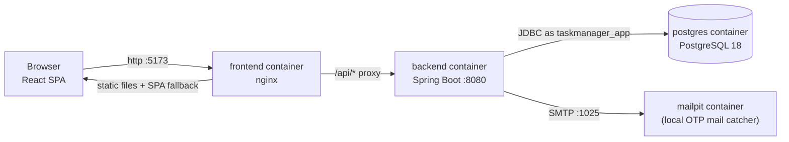
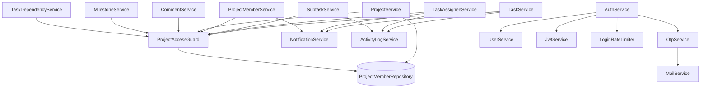

# System Architecture

How the application is put together. File and class names are the real ones; the reasoning behind the main choices is recorded as decision records in [adr/](adr/README.md).

## 1. Runtime topology



Defined in `docker-compose.yml`:

| Service | Image / build | Host port | Notes |
|---|---|---|---|
| `postgres` | `postgres:18-alpine` | `${POSTGRES_PORT:-5432}` | Runs everything in `database/init/` on first start of an empty volume (`pgdata`) |
| `mailpit` | `axllent/mailpit:latest` | `1025` (SMTP), `8025` (web UI) | |
| `backend` | `./backend` (multi-stage: Maven build, Temurin 25 JRE, runs as non-root user `spring`) | `${BACKEND_PORT:-8080}` | Waits for `postgres` and `mailpit` to be healthy; log file mounted at `./backend/logs` |
| `frontend` | `./frontend` (multi-stage: `npm run build`, then nginx) | `${FRONTEND_PORT:-5173}` → container port 80 | Waits for `backend` to be healthy |

The backend and frontend containers hold a **built copy** of the code. Changing source does not change a running container until the image is rebuilt (see [setup.md](setup.md)).

In local development (`npm run dev`), Vite's dev server replaces nginx and proxies `/api` to `http://localhost:8080` (`frontend/vite.config.js`). The frontend code is identical in both cases because it only uses relative `/api/...` URLs.

## 2. Backend architecture

### 2.1 Layers

```
HTTP request
   │
   ▼
Spring Security filter chain ── validates the JWT (signature + expiry); no JSON body on failure (401)
   │
   ▼
controller/        binds the request, runs Bean Validation (@Valid), reads the caller's name
   │                from Authentication, delegates — contains no business rules
   ▼
service/           business rules, authorization (ProjectAccessGuard), transactions,
   │                entity ↔ DTO mapping, notification and activity-log writes
   ▼
repository/        Spring Data JPA interfaces (derived queries and a few @Query methods)
   │
   ▼
PostgreSQL         constraints and triggers enforce the rules that must never be bypassed
```

Errors from any layer are turned into JSON by `exception/GlobalExceptionHandler` (`@RestControllerAdvice`). See [security.md](security.md#6-error-handling).

### 2.2 Services and what they own

| Service | Responsibility |
|---|---|
| `AuthService` | Login (with `LoginRateLimiter`), registration, OTP verify/resend |
| `JwtService` | Issues HS512 tokens (`sub` = username, optional `role` claim, 1 h default expiry) |
| `OtpService`, `MailService` | One-time codes (bcrypt-hashed), expiry, attempt cap, resend cooldown, the email |
| `CustomUserDetailsService` | Adapts a `User` for Spring Security; only `ACTIVE` accounts are enabled |
| `UserService` | User CRUD, self-service profile/password/photo/preferences, position/department, registration |
| `RoleService`, `RolePermissionService`, `PositionService`, `DepartmentService` | Role list, the role × resource × action matrix and its guarded editing, and the two org-wide lookup lists |
| `ProjectService` | Project CRUD, project-code generation, manager handling |
| `ProjectMemberService` | Membership, invitations (invite / accept / decline), pending count, invitable-user search |
| `ProjectAccessGuard`, `PermissionService` | **The single authorization entry point**: `ProjectAccessGuard.assertCan / assertSystemCan / assertAccess` answer through `PermissionService`, an in-memory snapshot of the `role_permissions` table ([ADR-0014](adr/0014-requirement-roles-and-permission-matrix.md)) |
| `MilestoneService` | Milestone CRUD |
| `TaskService` | Task CRUD, visibility scoping, status/priority/due-date change logging, "blocked" and subtask counts on responses |
| `TaskAssigneeService`, `TaskDependencyService` | Assignment and dependencies |
| `SubtaskService` | Subtasks and the To Do → In Progress auto-promotion |
| `CommentService` | Comments |
| `NotificationService` | Creates notifications and serves the caller's own |
| `ActivityLogService` | Writes and reads the per-task activity feed |

### 2.3 Major module relationships



`ProjectAccessGuard` depends on `ProjectMemberRepository` and `PermissionService`; every project-scoped service depends on it. `NotificationService` and `ActivityLogService` are called *by* other services right after the triggering change is saved — they never call back.

### 2.4 Cross-cutting design

- **DTOs everywhere.** No controller binds or returns a JPA entity. Nested objects (for example `ProjectResponse.manager`) are `UserResponse` DTOs.
- **Schema owned by SQL, not Hibernate.** `ddl-auto=validate`: the application refuses to start if an entity does not match the real schema.
- **Business rules at two levels.** Per-request rules (permissions, friendly error messages) live in services; cross-row invariants (dependency order, due dates, owner integrity, progress) live in database triggers so no code path can bypass them. Several rules exist at both levels on purpose (for example completing a task with open subtasks) — the service gives a clean early error, the trigger is the backstop.
- **Stateless.** No HTTP session; CSRF protection is disabled (`SecurityConfig`) because requests authenticate with a bearer token.
- **Single-instance assumptions.** `LoginRateLimiter` keeps its state in memory.

## 3. Frontend architecture

### 3.1 Composition

`src/main.jsx` wraps the app in providers, outermost first:

```
BrowserRouter
└─ AuthProvider            JWT, current user, login/logout, profile refresh
   └─ ThemeProvider        light / dark / system, synced to the saved preference
      └─ UsersProvider     user directory (GET /api/users) for avatars and name lookups
         └─ NotificationsProvider   notification list, unread count, read / delete
            └─ ToastProvider        transient success/error messages
               └─ App     routes
```

`App.jsx` defines the routes. Everything except `/login`, `/register` and `/verify-otp` sits behind `auth/ProtectedRoute`, which redirects to `/login` (remembering the original location). Authenticated pages render inside `layout/AppLayout` (sidebar + page).

### 3.2 Data access

- `api/client.js` — `apiFetch(path, { method, body, skipAuth })` adds `Authorization: Bearer <token>` (token read from `localStorage`, key `taskflow.auth`), sends JSON, and throws an `ApiError(status, message, fieldErrors)`. A `401` on an authenticated call clears the stored auth and triggers logout. `apiUpload` does the same for multipart uploads.
- `api/<resource>.js` — one small module per backend resource (`projects.js`, `tasks.js`, `projectMembers.js`, …). They are thin wrappers over `apiFetch`.
- `api/useApi.js` — a minimal fetch-on-mount hook returning `{ data, loading, error, refetch }`. It refetches when the `fetcher` function identity changes, so callers wrap fetchers in `useCallback`. There is no React Query/SWR; mutations call `refetch()` afterwards.
- Derived data helpers: `api/stats.js` (dashboard/report/Kanban grouping), `api/relations.js` (id → users maps, the caller's role per project), `api/format.js`, `api/validation.js` (password rules, mirrored from the backend), `api/permissions.js`.

### 3.3 Permissions in the UI

The UI no longer carries its own copy of the rules. After login `AuthContext` loads `GET /api/users/me/permissions` (a list of `RESOURCE:ACTION` strings, per project and system-wide) and exposes `can(resource, action, projectId)`, `canSys(...)` and `canAny(...)`; `api/permissions.js` only turns that list into those helpers. Controls the caller cannot use are hidden, not disabled. It is a convenience only — the backend remains the authority, and editing the matrix changes both at once.

### 3.4 Frontend pages and routes

| Route | Page | Purpose |
|---|---|---|
| `/login`, `/register`, `/verify-otp` | `Login`, `Register`, `VerifyOtp` | Public. Registration shows a live password checklist; OTP page has a 60 s resend cooldown |
| `/` | `Dashboard` | Task overview by status, top projects, activity chart |
| `/tasks` | `Tasks` | Tasks grouped by project then status; search, filter (priority, project, *My Tasks*), sort; create/edit/delete; expandable subtasks |
| `/projects`, `/projects/:id` | `Projects`, `ProjectDetail` | Project cards; detail with status/priority, tasks, members (add member), milestones |
| `/kanban` | `Kanban` | Columns To Do, In Progress, Review, Done, plus a computed Blocked column |
| `/calendar` | `Calendar` | Month / Week / Day views of tasks |
| `/team` | `Team` | Directory, per-member projects, invite to a project, remove from a project, position/department |
| `/reports` | `Reports` | Stat cards and charts (completion over time, project progress, productivity, workload) |
| `/profile`, `/settings` | `Profile`, `Settings` | Personal info, password, photo; theme and notification preference |

The task detail panel (`components/TaskDetailPanel.jsx`) is a right-hand drawer with subtasks, comments, dependencies and the activity feed. New Task and New Project use the same drawer layout (`TaskFormModal`, `NewProjectModal`); editing uses a centered modal.

## 4. API communication

- All calls go to relative `/api/...` paths; there is no configurable API base URL.
- JSON in, JSON out; success codes `200`, `201` (every `POST` that creates), `204` (every `DELETE` and `POST /api/notifications/read-all`). Endpoints that return nothing but are not deletes (`verify-otp`, `resend-otp`, `PUT /api/users/me/password`) answer `200` with an empty body.
- Errors use one shape (`timestamp`, `status`, `error`, `message`, `fieldErrors`) — see [api-reference.md](api-reference.md#2-conventions).
- Updates are **full-replace** `PUT`s (no `PATCH`): the client resends the whole object (`taskResponseToRequest` in `api/tasks.js` builds it).
- List endpoints return everything the caller may see; there is **no pagination** (the one bounded endpoint is the invitable-user search, capped at 20).
- Data is fetched on page load and after the user's own actions. There is **no polling or push**: for example, a newly received notification appears after the next reload/refetch.

## 5. Database access

JPA entities map the schema; repositories are Spring Data interfaces. Visibility scoping is done in services by first loading the caller's active project ids (`ProjectMemberRepository.findProjectIdsByUserId`) and filtering. The only database-level paging/filtering query is `UserRepository.findInvitableUsers`. Details: [database.md](database.md).

## 6. Important architectural decisions (summary)

Each has a full record with context, alternatives and consequences in [adr/](adr/README.md).

| Decision | Record |
|---|---|
| Stateless JWT instead of server sessions | [ADR-0001](adr/0001-stateless-jwt-authentication.md) |
| Authorization from per-project roles, not global roles | [ADR-0002](adr/0002-project-level-authorization.md) (partly superseded) |
| A data-driven permission matrix | [ADR-0014](adr/0014-requirement-roles-and-permission-matrix.md) |
| Two-level roles: system roles and project roles | [ADR-0015](adr/0015-two-level-roles-system-and-project.md) |
| A project *is* the team; invitations live on `project_members` | [ADR-0003](adr/0003-project-membership-and-invitations.md) |
| Task assignment as a join table with database-enforced rules | [ADR-0004](adr/0004-task-assignment-model.md) |
| Hand-written SQL schema; invariants in triggers | [ADR-0005](adr/0005-database-owned-schema-and-triggers.md) |
| DTOs on every endpoint | [ADR-0006](adr/0006-dto-layer.md) |
| Notifications written by application code | [ADR-0007](adr/0007-application-created-notifications.md) |
| Self-registration with emailed OTP | [ADR-0008](adr/0008-self-registration-with-otp.md) |
| Profile photos stored in the database, served by token | [ADR-0009](adr/0009-profile-photos-in-database.md) |
| Frontend calls relative `/api` paths behind a proxy | [ADR-0010](adr/0010-relative-api-paths-and-proxy.md) |
| Least-privilege database role for the backend | [ADR-0011](adr/0011-least-privilege-database-role.md) |
| Progress is derived by the database | [ADR-0012](adr/0012-derived-progress.md) |
| Task status is manual, with guarded exceptions | [ADR-0013](adr/0013-manual-task-status-with-guards.md) |
