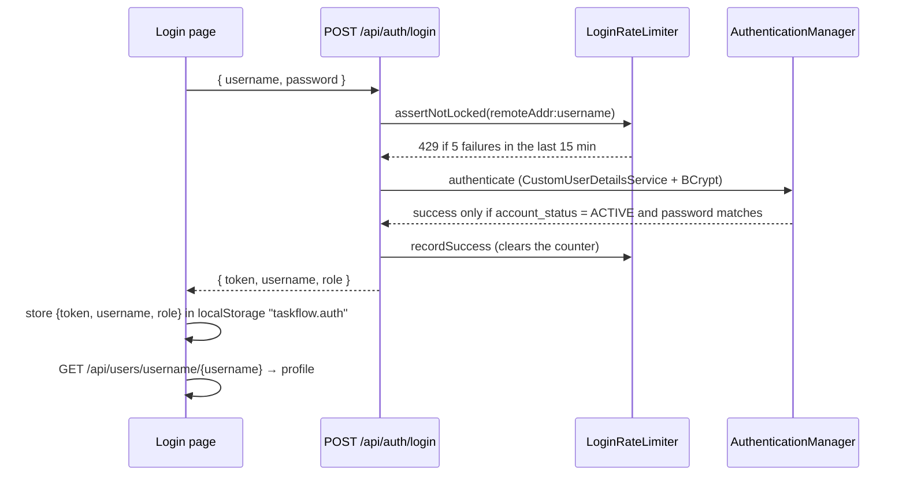
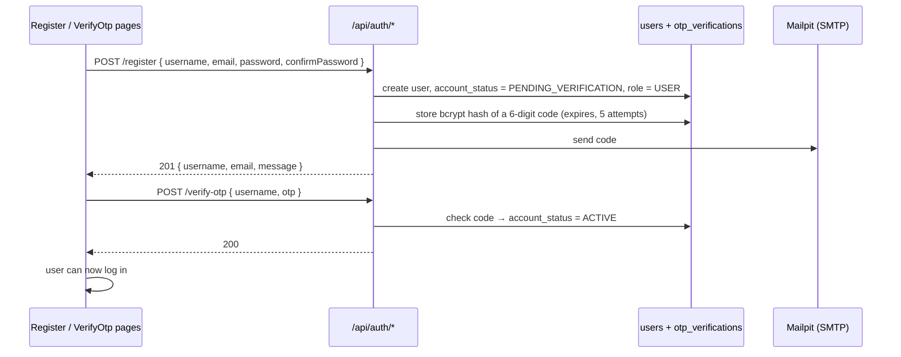

# Authentication & Authorization

Who a user is, what state their account can be in, and what they are allowed to do. Implementation: `backend/src/main/java/backend/` — `config/SecurityConfig.java`, `service/AuthService.java`, `JwtService.java`, `OtpService.java`, `LoginRateLimiter.java`, `CustomUserDetailsService.java`, `ProjectAccessGuard.java`; frontend: `frontend/src/auth/`, `api/permissions.js`.

Behaviours marked **(verified live)** were confirmed against the running application on 2026-10-06.

## 1. Authentication flow

### 1.1 Login

Details:

- **Credential is the username only.** The request field is `username`; logging in with an email address is **not** supported (`CustomUserDetailsService.loadUserByUsername` looks up by username). `Role_Requirment.md` asks for "Username or Email" — this is a gap (see [issues.md](issues.md)).
- **Any failure returns the same message** — `401 Unauthorized`, `"Invalid username or password"` — whether the user does not exist, the password is wrong, or the account is not `ACTIVE`. This does not reveal which accounts exist.
- **Rate limiting.** `LoginRateLimiter` keeps failure timestamps in memory, keyed `remoteAddr + ":" + username`. After **5** failures within **15 minutes** the next attempt returns `429 Too Many Requests` (`"Too many failed login attempts. Try again later."`). A successful login clears the counter. State is lost on restart and not shared between instances.
- **Token.** `JwtService` issues an HS512-signed JWT with `sub` = username, `iat`, `exp`, and — only when the user has a global role — a `role` claim. Lifetime is `app.jwt.expiration-ms` (`JWT_EXPIRATION_MS`, default `3600000` = 1 hour). The signing key is `app.jwt.secret` (`JWT_SECRET`); `JwtSecretGuard` logs a warning at startup if it is still the built-in development value.
- **Per request.** Spring's OAuth2 resource server validates the signature and expiry. `SecurityConfig` maps the `role` claim to a `ROLE_<name>` authority (so `@PreAuthorize("hasRole('ADMINISTRATOR')")` works). Services then identify the caller by `authentication.getName()` (the `sub` claim).
- **Public endpoints:** `GET /api/health`, `POST /api/auth/login`, `/register`, `/verify-otp`, `/resend-otp`, and `GET /api/photos/**`. Everything else requires a valid token.
- **No token, bad token or expired token** → `401` with an **empty body** (produced by Spring Security's filter, before the exception handler) and a `WWW-Authenticate: Bearer` header **(verified live)**.
- **Logout is client-side only.** The frontend deletes `taskflow.auth` (`AuthContext.logout`); there is no logout endpoint and no token revocation. A `401` on any authenticated call also logs the user out (`api/client.js`).
- **No refresh tokens.** When the token expires the user must log in again.
- **A deactivated account's token is rejected immediately** (fixed 2026-10-06). While every JWT is decoded, `ActiveAccountJwtValidator` looks up the account's *current* status (one small status-only query per request) and returns `401` if the account is missing or not `ACTIVE` — **verified live**: a token that worked returned `401` right after the account was set to `SUSPENDED`, and worked again after it was reactivated (`permissions.spec.js`). Before the fix a token stayed valid until it expired.

### 1.2 Self-registration with email verification

| Rule | Value | Source |
|---|---|---|
| Username | 3–50 chars; letters, numbers, `.`, `_`, `-` only | `RegisterRequest` |
| Email | valid format, max 255 | `RegisterRequest` |
| Password | see [section 4](#4-password-policy); `confirmPassword` must match | `RegisterRequest`, `UserService.registerSelfServiceUser` |
| Username / email uniqueness | case-insensitive; `"Username is already taken"` / `"Email is already registered"` (400) | `UserService`, indexes `idx_users_username_lower`, `idx_users_email_lower` |
| Code | 6 digits (`SecureRandom`), stored only as a bcrypt hash | `OtpService` |
| Expiry | `app.otp.expiration-minutes` (`OTP_EXPIRATION_MINUTES`), default 10 | `application.properties` |
| Verify attempts | `app.otp.max-attempts` (`OTP_MAX_ATTEMPTS`), default 5; each wrong code shows how many remain | `OtpService.verify` |
| Resend cooldown | `app.otp.resend-cooldown-seconds` (`OTP_RESEND_COOLDOWN_SECONDS`), default 60; too soon → `429` | `OtpService.resendOtp` |
| Verify/resend on an already-verified account | `400 "This account is already verified"` | `AuthService` |
| Other verify failures | no code on file, already used, expired, attempts exhausted → `400` with a specific message | `OtpService.verify` |

Notes:

- A new account's `fullName` defaults to its username; the user completes the profile later.
- A `PENDING_VERIFICATION` account cannot log in, **and its username and email stay reserved** — a second registration with the same username fails with "Username is already taken". There is no cleanup job for abandoned registrations (**Unknown / Needs clarification** whether this is intended).
- Resending a code creates a new `otp_verifications` row; verification always checks the **latest** code only.
- Mail host is `MAIL_HOST` (default `mailpit`). Outside Docker set it to `localhost` — see [setup.md](setup.md).

## 2. Account statuses

`users.account_status` (CHECK constraint in `01-init.sql`):

| Status | How an account gets it | Can log in | Can be invited / assigned | Notes |
|---|---|---|---|---|
| `PENDING_VERIFICATION` | Self-registration, until OTP is verified | No | No (cannot be invited — see [users-and-projects.md](users-and-projects.md#4-invitations)) | Set by `registerSelfServiceUser` |
| `ACTIVE` | OTP verified; or created by an administrator (default) | Yes | Yes | The only status `CustomUserDetailsService` treats as enabled |
| `INACTIVE` | Set by an administrator (`PUT /api/users/{id}`, `POST /api/users`) | No (new logins) | No | An administrator cannot make a user inactive while they are the **sole active owner** of a project (`400`) |
| `SUSPENDED` | Same as `INACTIVE` | No (new logins) | No | Seed data includes one of each: `contractor.felix` (INACTIVE), `exemployee.diego` (SUSPENDED) |

Where the status is enforced:

- **Login** — `CustomUserDetailsService` marks every non-`ACTIVE` account as disabled.
- **Task assignment** — database trigger `trg_task_assignees_not_suspended`.
- **Subtask assignment** — `SubtaskService.applyRequest` (a plain FK column has no trigger).
- **Project invitation and direct add** — `ProjectMemberService.assertEligibleForTeam`.
- **Invitation suggestions** — `UserRepository.findInvitableUsers` returns `ACTIVE` accounts only.
- **Existing sessions** — enforced on every request by `ActiveAccountJwtValidator` (see section 1.1).

## 3. Global roles

The `roles` table has exactly two rows (`01-init.sql`, migration `V7`):

| Role | Given to | Effect |
|---|---|---|
| `ADMINISTRATOR` | Only by an administrator editing an account (`roleId`); never at registration | A **system-wide bypass**: sees every project and task, can manage every project, manages user accounts and the roles list, creates positions/departments |
| `USER` | Every self-registered account | **No privileges at all** — a label only |
| *(none, `role_id` NULL)* | Accounts created by an administrator without a role (the common case in the seed data) | Same as `USER` |

The role is read from `users.role_id` at login and carried in the token. Code compares the role *name* (`"ADMINISTRATOR"`) — see `ProjectAccessGuard.isAdmin`, `UserService.isSystemAdministrator`, and the `@PreAuthorize` annotations.

`@PreAuthorize("hasRole('ADMINISTRATOR')")` guards exactly these endpoints: `POST/PUT/DELETE /api/users` (create, update by id, delete), `POST/PUT/DELETE /api/roles`, `POST /api/positions`, `POST /api/departments`.

The four roles named in `Role_Requirment.md` (Administrator, Project Manager, Team Leader, Team Member) are **not** global roles in this application; they were removed by migration `V5__project_scoped_authorization.sql`. The closest equivalents are the project roles below. See [ADR-0002](adr/0002-project-level-authorization.md).

## 4. Password policy

One rule, defined once in `dto/PasswordPolicy.java` and mirrored for the UI in `frontend/src/api/validation.js` (`PASSWORD_PATTERN`, `PASSWORD_RULES`):

- at least **8 characters**
- at least one **uppercase** letter
- at least one **lowercase** letter
- at least one **digit**
- at least one **special** character (anything that is not a letter or digit)

Regex: `^(?=.*[a-z])(?=.*[A-Z])(?=.*\d)(?=.*[^A-Za-z0-9]).{8,}$`. Message: *"Password must be at least 8 characters and include an uppercase letter, a lowercase letter, a number, and a special character"*.

Applied to: self-registration (`RegisterRequest`), changing your own password (`ChangePasswordRequest.newPassword`), administrator account creation (`UserCreateRequest`), administrator password reset (`UserService.updateUser`, only when a password is supplied). **Not** applied to login — an old or seeded password must still work.

UI: Register, Profile → Password, and the *Invite Member* dialog show a live checklist (`components/ui/PasswordChecklist.jsx`); a failed client check names the missing rules (`describePasswordProblem`); a backend `fieldErrors` message is surfaced by `passwordErrorMessage`.

Storage: BCrypt (`BCryptPasswordEncoder`, default strength). Passwords are never returned in any response. Changing your own password requires the **current** password (`"Current password is incorrect"`, 400).

There is no password-reset ("forgot password") flow and no password expiry or history.

## 5. Project-level roles

Real authority comes from the caller's **active** `project_members` row for the project in question (`project_role`). The same person can be `OWNER` of one project and `VIEWER` of another.

| Role | Meaning | Granted |
|---|---|---|
| `OWNER` | Full authority, including deleting the project and promoting someone to `OWNER` | Automatically to whoever creates the project (and to a project's manager) |
| `ADMIN` | Manages content and members; cannot delete the project or grant `OWNER` | By an owner/admin via the API (`PUT/POST /api/project-members`) — the UI has no control to choose a role |
| `MEMBER` | Creates and edits tasks | Default for accepted invitations and direct adds |
| `VIEWER` | Read-only: can read, cannot write tasks, subtasks or comments | Via the API or seed data |

A **`PENDING`** or **`DECLINED`** membership grants nothing: every visibility check uses `status = 'ACTIVE'` (`ProjectMemberRepository.findProjectIdsByUserId`, `ProjectAccessGuard.activeRole`).

**Invariant:** a project can never be left with zero active owners — enforced in `ProjectMemberService.assertNotRemovingLastOwner`, in `UserService.assertNotSoleOwnerOfAnyProject` (deactivating or deleting an account), and by trigger `trg_project_members_owner_integrity`. To transfer ownership, promote the new owner first, then demote or remove the old one.

### 5.1 Helper methods (`ProjectAccessGuard`)

| Method | True when the caller is… | Used for |
|---|---|---|
| `isAdmin` | a system `ADMINISTRATOR` | bypass |
| `hasAccess` / `assertAccess` | `ADMINISTRATOR`, or an active member with any role | all reads |
| `canManage` / `assertCanManage` | `ADMINISTRATOR`, or active `OWNER` / `ADMIN` | update project, milestones, members, invitations, assignment, dependencies, task deletion |
| `canEditContent` / `assertCanEditContent` | `ADMINISTRATOR`, or active `OWNER` / `ADMIN` / `MEMBER` | creating tasks; creating/editing/deleting subtasks; adding comments; the assigned-user task update |
| `isOwner` / `assertIsOwner` | `ADMINISTRATOR`, or active `OWNER` | deleting a project; granting `OWNER` |

`assertAccess` throws **404** (`"Project not found"`), not 403, so the existence of a project is not revealed to non-members. The other `assert…` methods throw `AccessDeniedException` → **403**.

### 5.2 Permission matrix

✅ allowed · ❌ not allowed · "assigned" = the caller is a current assignee of that task. `ADMINISTRATOR` can do everything in this table.

| Action | OWNER | ADMIN | MEMBER | VIEWER | Non-member |
|---|---|---|---|---|---|
| View project, milestones, members, tasks, dependencies, assignees, activity | ✅ | ✅ | ✅ | ✅ | ❌ (404) |
| Create a project | ✅ any authenticated user | | | | |
| Edit project details / status | ✅ | ✅ | ❌ | ❌ | ❌ |
| Change the project manager | `ADMINISTRATOR` only (other callers' `managerId` is ignored) | | | | |
| Delete project | ✅ | ❌ | ❌ | ❌ | ❌ |
| Create / edit / delete milestones | ✅ | ✅ | ❌ | ❌ | ❌ |
| Invite; list pending invitations; pending count; search invitable users | ✅ | ✅ | ❌ | ❌ | ❌ |
| Add / change / remove a member directly (`/api/project-members`) | ✅ | ✅ | ❌ | ❌ | ❌ |
| …and grant `OWNER` | ✅ | ❌ | ❌ | ❌ | ❌ |
| Create a task | ✅ | ✅ | ✅ | ❌ | ❌ |
| Edit every field of a task | ✅ | ✅ | ❌ | ❌ | ❌ |
| Change status / progress of a task **assigned to you** | ✅ | ✅ | ✅ if assigned | ❌ | ❌ |
| Delete a task | ✅ | ✅ | ❌ | ❌ | ❌ |
| Assign / unassign; add / remove dependencies | ✅ | ✅ | ❌ | ❌ | ❌ |
| Create / edit / delete **subtasks** | ✅ | ✅ | ✅ | ❌ | ❌ |
| Add a **comment** | ✅ | ✅ | ✅ | ❌ | ❌ |
| Edit a comment | author only (nobody else, not even an administrator) | | | | |
| Delete a comment | author, or `OWNER` / `ADMIN` | | | | |
| Accept / decline an invitation | the invited user only | | | | |

**Cells verified live on 2026-10-06:** a non-member reading a project → `404`; a `MEMBER` editing a project or creating a milestone → `403`; an `ADMIN` granting `OWNER` → `403`; a system administrator editing another user's comment → `403`; a `VIEWER` creating a task, comment or subtask → `403`; an owner moving a task into a project they do not belong to → `403`. Everything in this table is covered by `permissions.spec.js`, `TaskServiceTest`, `ViewerWriteAccessTest`, `MilestoneServiceTest` or `ProjectMemberServiceTest` where it changed on 2026-10-06; the other cells are from reading the code.

`VIEWER` is **read-only**: it can read everything it has access to but cannot create, edit or delete tasks, subtasks or comments, nor change a task even if it was assigned to them. Subtask and comment writes require content-edit rights (`ProjectAccessGuard.assertCanEditContent`); the task update path checks `canEditContent` before the assignment check. Before 2026-10-06 subtasks, comments and the "assigned" update only checked membership/assignment, so a viewer could write (verified live then); the task panel now also hides those controls from viewers.

### 5.3 Task update rule (row-level)

`PUT /api/tasks/{id}` (`TaskService.updateTask`):

1. The caller's right to edit is checked against the task's **current** project: `canManage` → every field is applied. **If the request changes `projectId`, the caller must also be able to manage the *target* project** (`403` otherwise — this closed a hole where an owner could push tasks into any project). Otherwise
2. the caller needs content-edit rights (`OWNER`/`ADMIN`/`MEMBER` — a `VIEWER` gets `403 "You do not have permission to edit this task"`), **and** must be a current assignee (`403 "You are not assigned to this task"` otherwise); then **only `status` and `progress`** from the request are applied — every other field, including `projectId`, is silently ignored, not rejected.

Two checks happen regardless of role: completing a task with open subtasks is refused (`400 "Complete all subtasks before marking this task as done."`), and the database dependency/subtask/date triggers apply.

## 6. System-level user management

| Action | Who | Where |
|---|---|---|
| Create, update, delete any user | `ADMINISTRATOR` | `UserController` `@PreAuthorize`; UI: *Invite Member* on the Team page creates an account with a temporary password |
| List users | everyone, **scoped**: an administrator sees all; others see themselves plus people who share an active project with them | `UserService.getAllUsers` |
| Look up one user by id or username | **scoped** — an administrator, the user themself, or someone who shares an active project with them; anyone else gets `404` (fixed 2026-10-06) | `GET /api/users/{id}`, `/api/users/username/{username}` — `UserService.assertCanView` |
| Edit own profile, password, photo, preferences | the user themself (target comes from the token, not the URL) | `/api/users/me*` |
| Set another user's position/department | `ADMINISTRATOR`, or an active `OWNER`/`ADMIN` of a project the target is also an active member of; **never yourself** | `UserService.updateMemberPositionDepartment` |
| Create positions / departments | `ADMINISTRATOR` only | `PositionController`, `DepartmentController` |

Any account — including an administrator's — cannot be set to `INACTIVE`/`SUSPENDED` or deleted while it is the sole active owner of a project (`400`, `UserService.assertNotSoleOwnerOfAnyProject`). Removing a user's `ADMINISTRATOR` role is not subject to that check.

## 7. Frontend authorization

- `auth/AuthContext.jsx` holds `token`, `username`, `role`, `profile`, `loading`. On load it restores `taskflow.auth` from `localStorage` and fetches the profile; if that fails it logs out.
- `auth/ProtectedRoute.jsx` redirects unauthenticated visitors to `/login`.
- `api/permissions.js` hides controls the caller cannot use (see [architecture.md](architecture.md#33-permissions-in-the-ui)). It is advisory.
- `api/relations.js → getActiveProjectMembers` and `buildMyProjectRoleMap` derive assignee candidates and the caller's role per project.
