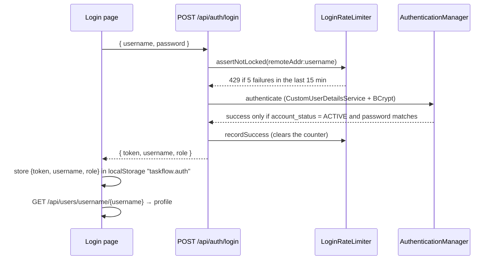
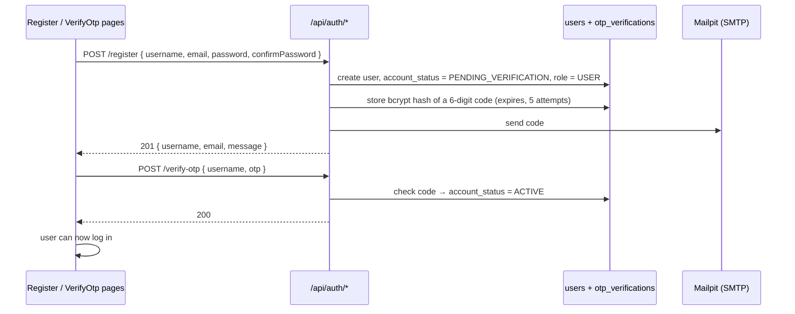

# Authentication & Authorization

Who a user is, what state their account can be in, and what they are allowed to do. Implementation: `backend/src/main/java/backend/` — `config/SecurityConfig.java`, `service/AuthService.java`, `JwtService.java`, `OtpService.java`, `LoginRateLimiter.java`, `CustomUserDetailsService.java`, `ProjectAccessGuard.java`; frontend: `frontend/src/auth/`, `api/permissions.js`.

Behaviours marked **(verified live)** were confirmed against the running application on 2026-10-06.

## 1. Authentication flow

### 1.1 Login

Details:

- **Credential is the username or the e-mail address** (since 2026-10-09). The request field is still called `username`; `AuthService.login` first calls `UserService.resolveLoginIdentifier`, which maps an e-mail address (anything containing `@`, compared case-insensitively) to the account's username, then authenticates as before. A username can never contain `@` (registration forbids it), so the two cannot be confused. The token's subject is always the username. An unknown e-mail falls through to the normal `401 "Invalid username or password"`.
- **Any failure returns the same message** — `401 Unauthorized`, `"Invalid username or password"` — whether the user does not exist, the password is wrong, or the account is not `ACTIVE`. This does not reveal which accounts exist.
- **Rate limiting.** `LoginRateLimiter` keeps failure timestamps in memory, keyed `remoteAddr + ":" + <what was typed>`. After **5** failures within **15 minutes** the next attempt returns `429 Too Many Requests` (`"Too many failed login attempts. Try again later."`). A successful login clears the counter. State is lost on restart and not shared between instances.
- **Token.** `JwtService` issues an HS512-signed JWT with `sub` = username, `iat`, `exp`, and — only when the user has a global role — a `role` claim. Lifetime is `app.jwt.expiration-ms` (`JWT_EXPIRATION_MS`, default `3600000` = 1 hour). The signing key is `app.jwt.secret` (`JWT_SECRET`); `JwtSecretGuard` logs a warning at startup if it is still the built-in development value.
- **Per request.** Spring's OAuth2 resource server validates the signature and expiry. `SecurityConfig` maps the `role` claim to a `ROLE_<name>` authority (so `@PreAuthorize("hasRole('ADMINISTRATOR')")` works). Services then identify the caller by `authentication.getName()` (the `sub` claim).
- **Public endpoints:** `GET /api/health`, `POST /api/auth/login`, `/register`, `/verify-otp`, `/resend-otp`, and `GET /api/photos/**`. Everything else requires a valid token.
- **No token, bad token or expired token** → `401` with an **empty body** (produced by Spring Security's filter, before the exception handler) and a `WWW-Authenticate: Bearer` header **(verified live)**.
- **Logout is client-side only.** The frontend deletes `taskflow.auth` (`AuthContext.logout`); there is no logout endpoint and no token revocation. A `401` on any authenticated call also logs the user out (`api/client.js`).
- **No refresh tokens.** When the token expires the user must log in again.
- **A deactivated account's token is rejected immediately** (fixed 2026-10-06). While every JWT is decoded, `ActiveAccountJwtValidator` looks up the account's *current* status (one small status-only query per request) and returns `401` if the account is missing or not `ACTIVE` — **verified live**: a token that worked returned `401` right after the account was set to `SUSPENDED`, and worked again after it was reactivated (`permissions.spec.js`). Before the fix a token stayed valid until it expired.

### 1.2 Self-registration with email verification

| Rule | Value | Source |
|---|---|---|
| Username | 3–50 chars; letters, numbers, `.`, `_`, `-` only | `RegisterRequest` |
| Email | valid format, max 255 | `RegisterRequest` |
| Password | see [section 4](#4-password-policy); `confirmPassword` must match | `RegisterRequest`, `UserService.registerSelfServiceUser` |
| Username / email uniqueness | case-insensitive; `"Username is already taken"` / `"Email is already registered"` (400) | `UserService`, indexes `idx_users_username_lower`, `idx_users_email_lower` |
| Code | 6 digits (`SecureRandom`), stored only as a bcrypt hash | `OtpService` |
| Expiry | `app.otp.expiration-minutes` (`OTP_EXPIRATION_MINUTES`), default 10 | `application.properties` |
| Verify attempts | `app.otp.max-attempts` (`OTP_MAX_ATTEMPTS`), default 5; each wrong code shows how many remain | `OtpService.verify` |
| Resend cooldown | `app.otp.resend-cooldown-seconds` (`OTP_RESEND_COOLDOWN_SECONDS`), default 60; too soon → `429` | `OtpService.resendOtp` |
| Verify/resend on an already-verified account | `400 "This account is already verified"` | `AuthService` |
| Other verify failures | no code on file, already used, expired, attempts exhausted → `400` with a specific message | `OtpService.verify` |

Notes:

- A new account's `fullName` defaults to its username; the user completes the profile later.
- A `PENDING_VERIFICATION` account cannot log in, **and its username and email stay reserved** — a second registration with the same username fails with "Username is already taken". There is no cleanup job for abandoned registrations (**Unknown / Needs clarification** whether this is intended).
- Resending a code creates a new `otp_verifications` row; verification always checks the **latest** code only.
- Mail host is `MAIL_HOST` (default `mailpit`). Outside Docker set it to `localhost` — see [setup.md](setup.md).

## 2. Account statuses

`users.account_status` (CHECK constraint in `01-init.sql`):

| Status | How an account gets it | Can log in | Can be invited / assigned | Notes |
|---|---|---|---|---|
| `PENDING_VERIFICATION` | Self-registration, until OTP is verified | No | No (cannot be invited — see [users-and-projects.md](users-and-projects.md#4-invitations)) | Set by `registerSelfServiceUser` |
| `ACTIVE` | OTP verified; or created by an administrator (default) | Yes | Yes | The only status `CustomUserDetailsService` treats as enabled |
| `INACTIVE` | Set by an administrator (`PUT /api/users/{id}`, `POST /api/users`) | No (new logins) | No | An administrator cannot make a user inactive while they are the **sole active owner** of a project (`400`) |
| `SUSPENDED` | Same as `INACTIVE` | No (new logins) | No | Seed data includes one of each: `contractor.felix` (INACTIVE), `exemployee.diego` (SUSPENDED) |

Where the status is enforced:

- **Login** — `CustomUserDetailsService` marks every non-`ACTIVE` account as disabled.
- **Task assignment** — database trigger `trg_task_assignees_not_suspended`.
- **Subtask assignment** — `SubtaskService.applyRequest` (a plain FK column has no trigger).
- **Project invitation and direct add** — `ProjectMemberService.assertEligibleForTeam`.
- **Invitation suggestions** — `UserRepository.findInvitableUsers` returns `ACTIVE` accounts only.
- **Existing sessions** — enforced on every request by `ActiveAccountJwtValidator` (see section 1.1).

## 3. Roles and permissions

Two levels of role, one permission table ([ADR-0015](adr/0015-two-level-roles-system-and-project.md), specified in [assignment-brief.md](../assignment-brief.md) Part B). Implemented by migration `V10__two_level_roles.sql` on 2026-10-08.

| Level | Roles | Stored on | Answers |
|---|---|---|---|
| **System role** | `ADMINISTRATOR`, `PROJECT_MANAGER`, `USER` | the account (`users.role_id`) | what the person may do **anywhere** |
| **Project role** | `OWNER`, `ADMIN`, `MEMBER`, `VIEWER` | one membership (`project_members.project_role`) | what the person may do **inside one project** |

A person has exactly one system role and one project role in each project they belong to. There is no single global hierarchy.

| Requirement name | Representation |
|---|---|
| Administrator | system role `ADMINISTRATOR` |
| Project Manager | system role `PROJECT_MANAGER` **and normally** project role `OWNER` on the projects they manage — two different roles: the first lets a person create projects and see cross-project reports; the second gives authority inside one project |
| Team Leader | project role `ADMIN` |
| Team Member | project role `MEMBER` |
| Viewer | project role `VIEWER` (not named in the assignment; kept for read-only participants) |
| everyone else | system role `USER` (the default for every new account) |

The `roles` table holds all seven (`scope` = `SYSTEM` or `PROJECT`; `roles.project_role` names the project role a project row stands for). **Permissions** (`permissions` table): `VIEW`, `CREATE`, `EDIT`, `DELETE`, `ASSIGN`, `APPROVE`, `GENERATE_REPORTS`. **Grants** (`role_permissions`): one row per *(role, permission, resource, scope)*; resources `PROJECT`, `MILESTONE`, `MEMBER`, `TASK`, `TASK_STATUS`, `SUBTASK`, `COMMENT`, `WORK_LOG`, `REPORT`, `USER`, `ROLE`, `LOOKUP`; scope `SYSTEM` (anywhere) or `PROJECT` (inside a project where the user holds that project role).

**Decision chain** (`ProjectAccessGuard` → `PermissionService`): the account must be `ACTIVE` → `ADMINISTRATOR` is allowed everywhere and bypasses membership → a **system-level** action needs the matching system grant → a **project-level** action needs an `ACTIVE` membership and is allowed by the **project role's** grants → ownership/assignment restrictions (section 5.2). **A system role never widens a project role**: it holds only system-scope grants, so a Project Manager who is only a `VIEWER` of a project can only read it. A non-member asking for a project gets `404`; everything else refused is `403` with a message that says what is missing.

**System-scope grants** (everything else is project scope):

| Resource:action | Administrator | Project Manager | User |
|---|---|---|---|
| `PROJECT:CREATE` — create a project | ✅ | ✅ | ❌ |
| `REPORT:GENERATE_REPORTS` — reports across every project the person belongs to | ✅ | ✅ | ❌ |
| `USER:*` — directory, accounts, give a system role | ✅ | ❌ | ❌ |
| `ROLE:*` — see and edit roles and the matrix | ✅ | ❌ | ❌ |
| `LOOKUP:CREATE` — new positions and departments | ✅ | ❌ | ❌ |

A Team Leader or Owner also reaches **Reports** through the project-scope grant `REPORT:GENERATE_REPORTS` (section 5.2); the Reports page and link appear for anyone who holds it at either level, and every `/api/reports/*` endpoint checks it on the server (an Administrator reports on all projects, anyone else on the projects where they hold it).

New accounts (self-registration, or an administrator creating one without choosing a role) are `USER`. An Administrator gives or changes a system role in **Administration → Users** (`PUT /api/users/{id}/role`); `ADMINISTRATOR` is never given at registration. **A person who owns a project cannot be moved to `USER`** until ownership is transferred (only a Project Manager or Administrator can own a project).

Guards: `@PreAuthorize("@permissions.require(authentication,'USER','CREATE')")` (class `security/PermissionChecker`) on user, role, position, department and permission endpoints; `ProjectAccessGuard.assertCan / assertSystemCan` inside services. A refused check throws `AccessDeniedException` → **403** with a specific sentence (`GlobalExceptionHandler`), for example *"Only a Project Manager or an Administrator can create a project"*.

**Editing the matrix:** an Administrator can change the grants of any role except `ADMINISTRATOR` (`PUT /api/roles/{id}/permissions`, which replaces the role's full grant list). `RolePermissionService` rejects unknown resources/permissions/scopes, grants in a scope the role does not have (a system role holds only system grants; a project role only project grants), and removing `PROJECT:VIEW` from a project role (members would be locked out). Built-in roles cannot be renamed or deleted. **The last Administrator cannot be demoted** (`400`). Creating *additional* system roles is a specified requirement (D-14) that is **not built yet**.

## 4. Password policy

One rule, defined once in `dto/PasswordPolicy.java` and mirrored for the UI in `frontend/src/api/validation.js` (`PASSWORD_PATTERN`, `PASSWORD_RULES`):

- at least **8 characters**
- at least one **uppercase** letter
- at least one **lowercase** letter
- at least one **digit**
- at least one **special** character (anything that is not a letter or digit)

Regex: `^(?=.*[a-z])(?=.*[A-Z])(?=.*\d)(?=.*[^A-Za-z0-9]).{8,}$`. Message: *"Password must be at least 8 characters and include an uppercase letter, a lowercase letter, a number, and a special character"*.

Applied to: self-registration (`RegisterRequest`), changing your own password (`ChangePasswordRequest.newPassword`), administrator account creation (`UserCreateRequest`), administrator password reset (`UserService.updateUser`, only when a password is supplied). **Not** applied to login — an old or seeded password must still work.

UI: Register, Profile → Password, and the *Invite Member* dialog show a live checklist (`components/ui/PasswordChecklist.jsx`); a failed client check names the missing rules (`describePasswordProblem`); a backend `fieldErrors` message is surfaced by `passwordErrorMessage`.

Storage: BCrypt (`BCryptPasswordEncoder`, default strength). Passwords are never returned in any response. Changing your own password requires the **current** password (`"Current password is incorrect"`, 400).

There is no password-reset ("forgot password") flow and no password expiry or history.

## 5. Project roles and the permission matrix

Real authority inside a project comes from the caller's **active** `project_members` row (`project_role`). The same person can be Owner of one project and Viewer of another.

| Project role | Business name | How a person gets it |
|---|---|---|
| `OWNER` | Project Manager (of this project) | Automatically for whoever creates the project; afterwards only by **transfer** (below). Never invited or added directly |
| `ADMIN` | Team Leader | Invited with that role, or changed by an Owner (a Team Leader can set Member / Viewer) |
| `MEMBER` | Team Member | Default for accepted invitations and direct adds |
| `VIEWER` | Viewer | Invited with that role or changed later |

A **`PENDING`** or **`DECLINED`** membership grants nothing: every visibility check uses `status = 'ACTIVE'` (`ProjectMemberRepository.findProjectIdsByUserId`, `ProjectAccessGuard.activeRole`).

**A project has exactly one `OWNER`**, and the owner is also the project's manager. Ownership moves in one step (`ProjectOwnership`): making an active member the owner (`PUT /api/project-members/{id}` with role `OWNER`, needs `PROJECT:ASSIGN`: the Owner or an Administrator) demotes the previous owner to `ADMIN` in the same transaction and updates the project's manager. The new owner must be an **active member who can own projects** (`PROJECT_MANAGER` or `ADMINISTRATOR`), otherwise `400 "<name> cannot own a project…"`. The owner's membership cannot be demoted or removed directly (`400 "…Transfer ownership to another member first"`), and nobody can be invited or added *as* the owner (`400 "A project has exactly one owner…"`). The database backs this with the deferred trigger `trg_project_members_single_owner` (checked at commit, skipped when the project itself is being deleted — so a project with a single owner can be deleted). An administrator creating or editing a project can name another manager; that is an ownership transfer with the same eligibility rule.

### 5.1 `ProjectAccessGuard`

| Method | Meaning |
|---|---|
| `isAdmin` | the caller is a system `ADMINISTRATOR` (bypass) |
| `hasAccess` / `assertAccess` | `ADMINISTRATOR`, or an active member with any role — all reads. Throws **404** (`"Project not found"`), not 403, so the existence of a project is not revealed to non-members |
| `activeRole` | the caller's active project role, or none |
| `can(user, projectId, Resource, Action)` / `assertCan` | project-scope grant of the caller's role in that project, or a system-scope grant of their system role, or `ADMINISTRATOR`. `assertCan` throws **403** with a specific message |
| `systemCan(user, Resource, Action)` / `assertSystemCan` | system-scope grants only (create a project, reports, users, roles) |
| `denialMessage` | the sentence used in the 403 |

`ADMINISTRATOR` can do everything in the tables below.

### 5.2 Project-scope matrix

These are the `role_permissions` rows with `scope = PROJECT` seeded by `V10` and `V13` (the matrix is 198 rows) (the Administrator holds all 98 grants; "—" = not granted). `V10` is also the source of the unit test `PermissionServiceTest`, which checks every role × resource × action × scope.

| Resource | Owner (`OWNER`) | Team Leader (`ADMIN`) | Team Member (`MEMBER`) | Viewer |
|---|---|---|---|---|
| `PROJECT` | View, Edit, Delete, Assign (transfer ownership) | View, Edit | View | View |
| `MILESTONE` | View, Create, Edit, Delete | View, Create, Edit, Delete | View | View |
| `MEMBER` (invite, direct add, change role, remove) | View, Create, Edit, Delete | View, Create, Edit, Delete | View | View |
| `TASK` | View, Create, Edit (every field), Delete, Assign, **Approve** | same | **View only** | View |
| `TASK_STATUS` (status/progress of a task assigned to you) | Edit | Edit | Edit | — |
| `SUBTASK` | View, Create, Edit, Delete | View, Create, Edit, Delete | View, Create, Edit (limited, below) | View |
| `COMMENT` | View, Create, Delete (moderate) | View, Create, Delete | View, Create | View |
| `WORK_LOG` | View, Create, Delete (any entry) | View, Create, Delete | View, Create | View |
| `ATTACHMENT` (files on a task or the project) | View, Create, Delete (any file) | View, Create, Delete | View, Create | View |
| `CHECKLIST_ITEM` | View, Create, Edit, Delete | View, Create, Edit, Delete | View, Create, Edit (limited, below) | View |
| `REPORT` (`GENERATE_REPORTS`) | ✅ for this project | ✅ for this project | — | — |

A Team Leader may delete work items and remove members (never the Owner) but **cannot delete the project, transfer ownership or grant `OWNER`**. Setting a member's project role follows B3.7 / B3.9: nobody changes their own; the Owner and an Administrator set any role; a Team Leader only moves a Team Member between *Team Member* and *Viewer* (`ProjectMemberService.assertMayChangeRole`). Team Tasks and Team Workload need `TASK:ASSIGN` in the project (`TeamViewsService`). A Team Member **does not create tasks**.

Rules the table cannot express (they depend on *who did it*, so they stay in code):

| Rule | Where |
|---|---|
| Edit a comment — author only (nobody else, not even an administrator) | `CommentService` |
| Change a member's project role — never your own; a Team Leader only Team Member ⇄ Viewer and never the Owner or another leader (`403`) | `ProjectMemberService.assertMayChangeRole` |
| See Team Tasks and Team Workload — `TASK:ASSIGN` in the project (`403` for a Team Member) | `TeamViewsService` |
| Delete an attachment — the uploader, or whoever holds `ATTACHMENT:DELETE` | `AttachmentService` |
| A Team Member ticks or renames a **checklist item** only on a task assigned to them (`403 "You can only change the checklist of tasks assigned to you"`); delete — the person who added it, or `CHECKLIST_ITEM:DELETE` | `ChecklistItemService` |
| Delete a comment or a work-log entry — the author, or whoever holds `COMMENT:DELETE` / `WORK_LOG:DELETE` | `CommentService`, `WorkLogService` |
| Change status/progress of a task without `TASK:EDIT` — only if you are a current assignee | `TaskService.updateTask` |
| A Team Member edits a **subtask** only if the task is assigned to them or the subtask is assigned to them (`403 "You can only change subtasks of tasks assigned to you"`); deleting a subtask needs `SUBTASK:DELETE` | `SubtaskService` |
| Accept / decline an invitation — the invited user only | `ProjectMemberService` |
| Change a project's manager — `ADMINISTRATOR` only; it transfers ownership | `ProjectService` → `ProjectOwnership` |
| The owner cannot be demoted or removed; ownership is transferred, and only to a Project Manager or Administrator | `ProjectMemberService`, `ProjectOwnership` |
| The last Administrator cannot be demoted; a person who owns a project cannot be moved to `USER` | `UserService` |

**Verified live on 2026-10-08** (after migration `V10`): a `USER` creating a project → `403` *"Only a Project Manager or an Administrator can create a project"*; a Project Manager → `201` and becomes the only Owner; a second Owner invite → `400 "…exactly one owner…"`; a plain `USER` made owner → `400 "…cannot own a project…"`; a Project Manager made owner → `200`, the previous owner became `ADMIN` and the manager changed; the former owner deleting the project → `403`; the new owner deleting a single-owner project → `204`; a Team Member creating a task → `403`; a Team Member editing a subtask of an unassigned task → `403`; a Team Leader removing a member → `204`; a Team Member setting a task Completed → `403` with the approval message, a Team Leader → `200`; a non-member reading a project → `404`; a Team Leader reading the matrix or assigning a role → `403`; editing the Administrator role → refused; demoting the only Administrator → `400`; a self-registered account is `USER` and cannot create a project. Covered by `e2e/roles-permissions.spec.js`, `e2e/permissions.spec.js`, `PermissionServiceTest` (every role × resource × action in `V10`), `ProjectOwnershipTest`, `ProjectMemberServiceTest`, `ProjectServiceTest`, `ViewerWriteAccessTest`, `ProjectAccessGuardTest`, `RolePermissionServiceTest`, `UserRoleServiceTest`, `TaskServiceTest`.

A `VIEWER` is **read-only**: it cannot create, edit or delete tasks, subtasks, comments or time entries, nor change a task it was assigned to. The task panel hides those controls.

### 5.3 Task update rule (row-level)

`PUT /api/tasks/{id}` (`TaskService.updateTask`):

1. **Completing** — if the request moves the task to `COMPLETED` (and it was not already), the caller needs `TASK:APPROVE` in that project (`403 "Only a Project Manager or Team Leader can approve a task as completed. Move it to In Review so it can be approved"`), must also be allowed to decide *this* task (below), and the task must have no open subtasks (`400 "Complete all subtasks before marking this task as done."`). The completion is recorded as the caller's approval. Moving a task into `IN_REVIEW` opens an approval request; moving it out of review withdraws the open one.
2. With `TASK:EDIT` → every field is applied. **If the request changes `projectId`, the caller must also be allowed to edit tasks in the *target* project** (`403` otherwise).
3. Without it, the caller needs `TASK_STATUS:EDIT` **and** must be a current assignee (`403 "You are not assigned to this task"`); then **only `status` and `progress`** are applied — every other field, including `projectId`, is silently ignored.

The database dependency/subtask/date triggers apply regardless of role.

**Approval rules** (`TaskApprovalService.whyNotAllowedToDecide`, assignment-brief.md B3.8 and D-05). Whoever completes or decides a task needs `TASK:APPROVE` in its project (Administrator; Project Manager through the Owner or Team Leader role) and, besides:

| Rule | Exception |
|---|---|
| When the task names an approver, only that person decides | the project `OWNER` and an `ADMINISTRATOR` |
| Nobody decides their own work: the person who asked for the review, or anyone assigned to the task | the project `OWNER` and an `ADMINISTRATOR` |
| Designating the approver needs `TASK:ASSIGN`; the person named must be an active member who holds `TASK:APPROVE` | — |

**Approval flow in the UI:** a Team Member (or anyone who may edit the task) presses *Submit for review* in the task panel, or takes the task *In Progress → In Review* with the quick-advance circle. An approver then decides in the panel (*Approve*, *Request changes*, *Reject*, each with a comment) or from the *Awaiting your approval* list on the Tasks page. The Completed option and "Mark as Completed" are hidden from people who may not decide that task, including an approver who works on it themselves (they submit it for review instead).

## 6. System-level user management

| Action | Who | Where |
|---|---|---|
| Create, update, delete any user | `USER:CREATE/EDIT/DELETE` (Administrator) | `UserController`; UI: *Add member* creates an account with a temporary password and an optional system role (default Team Member) |
| Give an account a system role | `USER:ASSIGN` (Administrator) | `PUT /api/users/{id}/role`; UI: *Administration → Users*. Refused for the project-only roles, for demoting the last Administrator, and for moving a person who owns a project to `USER` |
| List users | everyone, **scoped**: an administrator sees all; others see themselves plus people who share an active project with them | `UserService.getAllUsers` |
| Look up one user by id or username | **scoped** — an administrator, the user themself, or someone who shares an active project with them; anyone else gets `404` | `UserService.assertCanView` |
| Edit own profile, password, photo, preferences | the user themself (target comes from the token, not the URL) | `/api/users/me*` |
| See the caller's own permissions | the user themself | `GET /api/users/me/permissions` |
| Set your own position/department | any signed-in user, choosing from the managed lists (new list entries need `LOOKUP:CREATE`) | `UserService.updateOwnProfile` (`PUT /api/users/me`) |
| Set another user's position/department | `ADMINISTRATOR`, or someone with `MEMBER:EDIT` in a project the target is also an active member of; **never yourself** | `UserService.updateMemberPositionDepartment` |
| Create positions / departments | `LOOKUP:CREATE` (Administrator) | `PositionController`, `DepartmentController` |
| See / edit roles and the matrix | `ROLE:VIEW` / `ROLE:EDIT` (Administrator) | `RoleController`, `PermissionController`; UI: *Administration → Roles & Permissions* |

Any account — including an administrator's — cannot be set to `INACTIVE`/`SUSPENDED` or deleted while it is the sole active owner of a project (`400`, `UserService.assertNotSoleOwnerOfAnyProject`). The last Administrator cannot be demoted.

## 7. Frontend authorization

- `auth/AuthContext.jsx` holds `token`, `username`, `role`, `profile`, `permissions`, `loading`. On load it restores `taskflow.auth` from `localStorage`, fetches the profile and `GET /api/users/me/permissions`; if that fails it logs out. It exposes `can(resource, action, projectId)`, `canSys(resource, action)`, `canAny(resource, action)`, `isAdministrator` and `refreshProfile()` (called after the user's own role or the matrix changes).
- `auth/ProtectedRoute.jsx` redirects unauthenticated visitors to `/login`; `auth/RequirePermission.jsx` shows "You do not have access to this page" for a route the role may not open (Reports, Administration).
- `api/permissions.js` turns the server's `RESOURCE:ACTION` list into those helpers. **It contains no role names or rules** — what the server says is what the UI shows. It is advisory: the server checks every request.
- Controls the user cannot use are **hidden, not disabled** (task edit/delete, status choices, "New Project", the Reports and Administration links, comment box, subtask and time controls, invite role picker).
