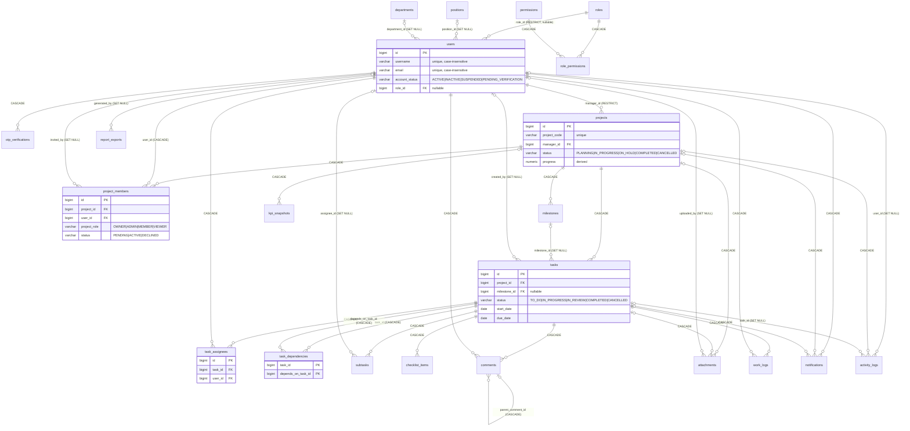

# Database

PostgreSQL schema as it actually exists. **Sources read:** `database/init/01-init.sql` (what Docker and CI execute), `02-seed.sql`, `03-app-role.sh`, `database/verify_invariants.sql`, and the Flyway migrations `database/taskmanager/migrations/V1…V10`. This page is both the structural reference (sections 1-10) and the operational guide that used to live in `database/README.md` (sections 11-14: running and inspecting, design decisions, authorization, backend coverage; migration details are in section 8). The folder README was removed.

- **22 tables**, 5 views, and 23 triggers: 7 `updated_at` triggers plus 16 rule/derivation triggers (see [section 5](#5-triggers-and-functions)).
- **18 tables** have JPA entities and repositories; **4 do not** (`checklist_items`, `attachments`, `report_exports`, `kpi_snapshots`). `permissions` and `role_permissions` are read by the backend since migration `V9`. Hibernate runs with `ddl-auto=validate`.
- Conventions: `BIGINT GENERATED ALWAYS AS IDENTITY` primary keys; timestamps are `TIMESTAMPTZ`; enum-like columns are `VARCHAR` + `CHECK` (not native enums).

## 1. Entity-relationship diagram

Generated from the foreign keys in `01-init.sql`. Attributes shown are the keys and the most important columns; complete column lists are in [section 3](#3-tables).



Reading notes: `||` = exactly one, `|o` = zero or one (nullable FK), `o{` = many. The label after the relationship is the FK column and its `ON DELETE` action (a bare `CASCADE` means the child's FK column is named after the parent).

### Relationship description (text form)

- A **user** optionally has one **role**, one **position**, one **department**. A user may *manage* many **projects** (`projects.manager_id`, `RESTRICT`: a user who is still a project's manager cannot be deleted).
- A **project** has many **project_members** (one row per user, unique), **milestones**, **tasks**, and optionally **attachments**, **notifications**, **activity_logs**, **kpi_snapshots**.
- A **task** belongs to exactly one project and optionally one milestone; it has many **task_assignees**, **subtasks**, **checklist_items**, **comments**, **work_logs**, and takes part in **task_dependencies** on either side.
- **Comments** form a tree through `parent_comment_id`.
- **Notifications** and **activity_logs** reference users, projects and tasks; deleting a task keeps its `activity_logs` rows (`task_id` becomes NULL) but deletes its `notifications`.

## 2. Status and enumeration fields

All enforced by `CHECK` constraints in `01-init.sql` (and mirrored by `@Pattern` on request DTOs).

| Table.column | Allowed values | Default |
|---|---|---|
| `users.account_status` | `ACTIVE`, `INACTIVE`, `SUSPENDED`, `PENDING_VERIFICATION` | `ACTIVE` |
| `users.theme_preference` | `LIGHT`, `DARK`, `SYSTEM` | `SYSTEM` |
| `roles.name` (seed, not a CHECK) | system: `ADMINISTRATOR`, `PROJECT_MANAGER`, `USER`; project: `OWNER`, `ADMIN`, `MEMBER`, `VIEWER` | — |
| `roles.scope` | `SYSTEM`, `PROJECT` (`BOTH` is allowed by the CHECK but no role uses it since `V10`) | `SYSTEM` |
| `role_permissions.scope` | `SYSTEM`, `PROJECT` | — |
| `projects.priority` | `LOW`, `MEDIUM`, `HIGH`, `CRITICAL` | `MEDIUM` |
| `projects.status` | `PLANNING`, `IN_PROGRESS`, `ON_HOLD`, `COMPLETED`, `CANCELLED` | `PLANNING` |
| `project_members.project_role` | `OWNER`, `ADMIN`, `MEMBER`, `VIEWER` | `MEMBER` |
| `project_members.status` | `PENDING`, `ACTIVE`, `DECLINED` | `ACTIVE` |
| `milestones.status` | `PENDING`, `IN_PROGRESS`, `COMPLETED` | `PENDING` |
| `tasks.priority` | `LOW`, `MEDIUM`, `HIGH`, `URGENT` | `MEDIUM` |
| `tasks.status` | `TO_DO`, `IN_PROGRESS`, `IN_REVIEW`, `COMPLETED`, `CANCELLED` | `TO_DO` |
| `subtasks.status` | `TO_DO`, `IN_PROGRESS`, `COMPLETED` | `TO_DO` |
| `otp_verifications.purpose` | `REGISTRATION` | `REGISTRATION` |
| `notifications.type` | `TASK_ASSIGNED`, `TASK_STATUS_CHANGED`, `COMMENT_ADDED`, `PROJECT_UPDATED`, `DEADLINE_REMINDER`, `OVERDUE_TASK`, `MILESTONE_UPDATED`, `TEAM_INVITATION`, `TEAM_INVITATION_RESPONDED` | — |
| `activity_logs.action` | `PROJECT_CREATED`, `PROJECT_UPDATED`, `PROJECT_COMPLETED`, `TASK_CREATED`, `TASK_DELETED`, `TASK_ASSIGNED`, `TASK_UNASSIGNED`, `TASK_STATUS_CHANGED`, `TASK_PRIORITY_CHANGED`, `TASK_DUE_DATE_CHANGED`, `TASK_COMPLETED`, `SUBTASK_ADDED`, `SUBTASK_COMPLETED`, `SUBTASK_DELETED`, `COMMENT_ADDED`, `FILE_UPLOADED`, `MILESTONE_CREATED`, `MILESTONE_COMPLETED` | — |
| `report_exports.report_type` | `PROJECT_REPORT`, `TASK_REPORT`, `PROJECT_STATUS_REPORT`, `TASK_COMPLETION_REPORT`, `OVERDUE_TASK_REPORT`, `TEAM_PERFORMANCE_REPORT`, `WORKLOAD_REPORT` | — |
| `report_exports.file_format` | `PDF`, `EXCEL` | — |

Progress columns (`projects`, `milestones`, `tasks`) are `NUMERIC(5,2)` constrained to 0–100.

## 3. Tables

Legend: **PK** primary key · **FK** foreign key (with `ON DELETE`) · **UQ** unique · **NN** not null · *implemented* = has a JPA entity.

### 3.1 Identity and access

**`roles`** *(implemented)* — two levels of role ([ADR-0015](adr/0015-two-level-roles-system-and-project.md)). `id` PK; `name` varchar(50) NN **UQ**; `description` varchar(255); `scope` varchar(10) NN (`SYSTEM`/`PROJECT`); `project_role` varchar(20) nullable **UQ** (set only on the project roles: the `project_members.project_role` value the row stands for); `built_in` boolean NN (built-in roles cannot be renamed or deleted); `created_at`. Seed: system roles `ADMINISTRATOR`, `PROJECT_MANAGER`, `USER`; project roles `OWNER`, `ADMIN`, `MEMBER`, `VIEWER`. Business names: Project Manager = `PROJECT_MANAGER` system role and normally `OWNER`; Team Leader = `ADMIN`; Team Member = `MEMBER`.

**`permissions`** — action catalog. `id` PK; `code` varchar(30) NN **UQ**; `description`. Seed: `VIEW`, `CREATE`, `EDIT`, `DELETE`, `ASSIGN`, `APPROVE`, `GENERATE_REPORTS` *(implemented — read-only)*.

**`role_permissions`** *(implemented)* — the permission matrix. Composite PK `(role_id, permission_id, resource, scope)`; `role_id`, `permission_id` FK `CASCADE`; `resource` varchar(30) NN (`PROJECT`, `MILESTONE`, `MEMBER`, `TASK`, `TASK_STATUS`, `SUBTASK`, `COMMENT`, `WORK_LOG`, `REPORT`, `USER`, `ROLE`, `LOOKUP`); `scope` varchar(10) NN CHECK `SYSTEM`/`PROJECT`; index on `permission_id`. Seed: **163 rows** — Administrator 84, Project Manager 2 (`PROJECT:CREATE`, `REPORT:GENERATE_REPORTS`), Owner 30, Admin 28, Member 12, Viewer 7, User 0. The matrix is listed in [authentication-authorization.md](authentication-authorization.md#52-project-scope-matrix); the SQL is `V10` / `01-init.sql`.

**`positions`**, **`departments`** *(implemented)* — org-wide lookup lists. `id` PK; `name` varchar(100) NN; `description` varchar(255); `created_at`. Unique index on `LOWER(name)`.

**`users`** *(implemented)*

| Column | Type | Constraints |
|---|---|---|
| `id` | bigint | PK |
| `full_name` | varchar(150) | NN |
| `username` | varchar(50) | NN; unique **index on `LOWER(username)`** |
| `email` | varchar(255) | NN; unique **index on `LOWER(email)`** |
| `password_hash` | varchar(255) | NN (BCrypt) |
| `gender` varchar(20), `date_of_birth` date, `phone_number` varchar(30) | | optional |
| `profile_photo` | bytea | optional image bytes |
| `profile_photo_content_type` | varchar(50) | optional |
| `profile_photo_token` | uuid | optional; partial unique index (`WHERE … IS NOT NULL`) |
| `position_id` | bigint | FK → `positions` `SET NULL` |
| `department_id` | bigint | FK → `departments` `SET NULL` |
| `role_id` | bigint | FK → `roles` `RESTRICT`, **nullable** |
| `account_status` | varchar(20) | NN, CHECK, default `ACTIVE` |
| `theme_preference` | varchar(10) | NN, CHECK, default `SYSTEM` |
| `task_notifications_enabled` | boolean | NN, default `true` |
| `created_at`, `updated_at` | timestamptz | NN, default `now()`; `updated_at` by trigger |

Indexes: `idx_users_username_lower`, `idx_users_email_lower` (unique), `idx_users_role_id`, `idx_users_position_id`, `idx_users_department_id`, `idx_users_profile_photo_token`.

**`otp_verifications`** *(implemented)* — registration codes. `id` PK; `user_id` NN FK → `users` `CASCADE`; `purpose` NN (`REGISTRATION`); `otp_hash` varchar(255) NN (BCrypt); `expires_at` NN; `attempts` int NN default 0; `max_attempts` int NN default 5; `consumed_at`; `last_sent_at` NN default `now()`; `created_at`. `CHECK (attempts <= max_attempts)`. Index on `user_id`.

### 3.2 Projects and teams

**`projects`** *(implemented)* — `id` PK; `project_code` varchar(30) NN **UQ** (constraint `projects_project_code_key`); `name` varchar(200) NN; `description` text; `start_date`, `end_date` date NN; `manager_id` NN FK → `users` `RESTRICT`; `priority`, `status` (see §2); `progress` NUMERIC(5,2) NN default 0; `created_at`, `updated_at`. `CHECK (end_date >= start_date)`. Indexes: `manager_id`, `status`.

**`project_members`** *(implemented)* — `id` PK; `project_id` NN FK → `projects` `CASCADE`; `user_id` NN FK → `users` `CASCADE`; `project_role`, `status` (§2); `invited_by` FK → `users` `SET NULL`; `responded_at`; `joined_at` NN default `now()`. **`UNIQUE (project_id, user_id)`**. Indexes: `project_id`, `user_id`, `status`. Constraint trigger `trg_project_members_single_owner`.

**`milestones`** *(implemented)* — `id` PK; `project_id` NN FK → `projects` `CASCADE`; `title` varchar(200) NN; `description` text; `due_date` NN; `status`, `progress`; `created_at`, `updated_at`. Index on `project_id`.

### 3.3 Tasks

**`tasks`** *(implemented)* — `id` PK; `project_id` NN FK → `projects` `CASCADE`; `milestone_id` FK → `milestones` `SET NULL`; `title` varchar(200) NN; `description` text; `priority`, `status`; `start_date`, `due_date` date **NN**; `estimated_hours` NUMERIC(6,2); `progress` NN default 0; `completed_at` timestamptz; `created_by` FK → `users` `SET NULL`; `created_at`, `updated_at`. `CHECK (due_date >= start_date)`. Indexes: `project_id`, `milestone_id`, `created_by`, `status`, `due_date`.

**`task_assignees`** *(implemented)* — `id` PK; `task_id` NN FK `CASCADE`; `user_id` NN FK `CASCADE`; `assigned_at` NN. **`UNIQUE (task_id, user_id)`**. Indexes on both FKs.

**`task_dependencies`** *(implemented; composite key class `TaskDependencyId`)* — PK `(task_id, depends_on_task_id)`; both FK → `tasks` `CASCADE`; `CHECK (task_id <> depends_on_task_id)`. Index on `depends_on_task_id`.

**`subtasks`** *(implemented)* — `id` PK; `task_id` NN FK `CASCADE`; `title` varchar(200) NN; `assignee_id` FK → `users` `SET NULL`; `due_date`; `status`; `created_at`, `updated_at`. Indexes: `task_id`, `assignee_id`.

**`checklist_items`** — `id` PK; `task_id` NN FK `CASCADE`; `content` varchar(300) NN; `is_completed` boolean NN default false; `sort_order` int NN default 0; `created_at`, `updated_at`. Index on `task_id`. **No entity/API/UI.**

**`comments`** *(implemented)* — `id` PK; `task_id` NN FK `CASCADE`; `user_id` NN FK `CASCADE`; `parent_comment_id` FK → `comments` `CASCADE`; `message` text NN; `created_at`, `updated_at`. Indexes: `task_id`, `user_id`, `parent_comment_id`.

**`attachments`** — `id` PK; `project_id` FK `CASCADE`; `task_id` FK `CASCADE`; `uploaded_by` FK → `users` `SET NULL`; `file_name` varchar(255) NN; `file_url` varchar(500) NN; `file_size` bigint; `mime_type` varchar(100); `uploaded_at` NN. `CHECK (num_nonnulls(project_id, task_id) = 1)` — attached to exactly one of project or task. Indexes on both FKs. **No entity/API/UI.**

**`work_logs`** *(implemented 2026-10-08)* — `id` PK; `task_id` NN FK `CASCADE`; `user_id` NN FK `CASCADE`; `work_date` date NN; `hours_worked` NUMERIC(5,2) NN `CHECK (> 0)`; `description` varchar(500); `created_at`. Indexes: `task_id`, `user_id`, `work_date`. Entity `WorkLog`, API `/api/work-logs`, UI in the task panel; a task's `actualHours` is the sum of its logs ([tasks.md](tasks.md#time-tracking-estimated-vs-actual)).

### 3.4 Notifications, history, reporting

**`notifications`** *(implemented)* — `id` PK; `user_id` NN FK → `users` `CASCADE`; `type` NN (§2); `title` varchar(200) NN; `message` varchar(500); `project_id` FK `CASCADE`; `task_id` FK `CASCADE`; `is_read` boolean NN default false; `created_at`. Indexes: `user_id`, `(user_id, is_read)`.

**`activity_logs`** *(implemented)* — `id` PK; `user_id` FK → `users` `SET NULL`; `action` NN (§2); `project_id` FK → `projects` `CASCADE`; `task_id` FK → `tasks` **`SET NULL`** (deliberately, so a `TASK_DELETED` row survives); `description` varchar(500); `created_at`. Indexes: `user_id`, `project_id`, `task_id`, `created_at DESC`.

**`report_exports`** — `id` PK; `report_type` NN, `generated_by` FK `SET NULL`, `filters` jsonb, `file_format` NN, `file_url`, `generated_at`. Indexes: `generated_by`, `report_type`. **Nothing writes to it.**

**`kpi_snapshots`** — `id` PK; `snapshot_date` date NN; `project_id` FK `CASCADE` (NULL = org-wide); `project_completion_rate`, `task_completion_rate`, `overdue_rate`, `on_time_completion_rate` NUMERIC(5,2); `average_task_completion_time` NUMERIC(10,2); `created_at`. `UNIQUE (snapshot_date, project_id)` — in PostgreSQL NULLs are distinct, so this does **not** prevent two org-wide snapshots on the same day. Indexes: `project_id`, `snapshot_date`. **Nothing writes to it.**

## 4. Views

| View | Definition (summary) | Used by the app? |
|---|---|---|
| `v_overdue_tasks` | tasks with `due_date < CURRENT_DATE` and status not `COMPLETED`/`CANCELLED` | Only by `fn_generate_overdue_notifications()`; the backend computes `overdue` itself in `TaskResponse` |
| `v_project_status_summary` | per project status: `project_count`, `delayed_count` (past `end_date`, not finished) | No |
| `v_task_completion_by_project` | per project: total and completed tasks, `completion_percentage = projects.progress` | No |
| `v_team_performance` | per user: assigned, completed, pending, overdue tasks, completion rate | No |
| `v_team_workload` | per user: assigned/active/overdue tasks, estimated hours, actual (logged) hours | No |

The four reporting views exist for the not-yet-built reports; the Reports page computes its charts in the browser from `/api/tasks` data.

## 5. Triggers and functions

All validation triggers raise with `ERRCODE '23514'` so they surface as `DataIntegrityViolationException` → a clean `400` (see [security.md](security.md#6-error-handling)). Function names omit the `check_`/`trg_fn_` prefix noise where obvious.

| Trigger | Table / event | Rule |
|---|---|---|
| `trg_users_updated_at`, `trg_projects_updated_at`, `trg_milestones_updated_at`, `trg_tasks_updated_at`, `trg_subtasks_updated_at`, `trg_checklist_items_updated_at`, `trg_comments_updated_at` | BEFORE UPDATE | set `updated_at = now()` |
| `trg_project_members_single_owner` | `project_members` AFTER INSERT/UPDATE/DELETE, **deferred to commit** | a project has **exactly one active owner**; skipped when the project itself is being deleted (replaced V8's `trg_project_members_owner_integrity`, which blocked deleting a single-owner project) |
| `trg_milestones_due_date_within_project` | `milestones` BEFORE INSERT/UPDATE | due date within the project's start–end dates |
| `trg_tasks_completed_at` | `tasks` BEFORE INSERT/UPDATE | stamp `completed_at` on `COMPLETED`, clear otherwise |
| `trg_tasks_due_date_within_project` | `tasks` BEFORE INSERT/UPDATE | `due_date ≤ project.end_date` |
| `trg_tasks_milestone_project_match` | `tasks` BEFORE INSERT/UPDATE | milestone belongs to the task's project |
| `trg_tasks_dependencies_status_gate` | `tasks` BEFORE INSERT/UPDATE | no `IN_PROGRESS`/`IN_REVIEW`/`COMPLETED` while a dependency is incomplete |
| `trg_task_dependencies_status_gate` | `task_dependencies` BEFORE INSERT/UPDATE | cannot add an incomplete prerequisite to an already-active task |
| `trg_task_dependencies_no_cycle` | `task_dependencies` BEFORE INSERT/UPDATE | no dependency cycles (recursive CTE) |
| `trg_task_assignees_project_member` | `task_assignees` BEFORE INSERT/UPDATE | assignee is an `ACTIVE` member of the task's project |
| `trg_task_assignees_not_suspended` | `task_assignees` BEFORE INSERT/UPDATE | assignee's `account_status` is `ACTIVE` |
| `trg_tasks_not_completed_with_open_subtasks` | `tasks` BEFORE UPDATE | cannot **enter** `COMPLETED` with an incomplete subtask |
| `trg_tasks_progress_derived_from_subtasks` | `tasks` BEFORE UPDATE | task `progress` follows subtask completion (when it has subtasks) |
| `trg_subtasks_sync_parent_task` | `subtasks` AFTER INSERT/UPDATE/DELETE | push subtask-derived progress to the parent task |
| `trg_tasks_progress_sync` | `tasks` AFTER INSERT/UPDATE/DELETE | recompute the project's and milestone's progress |
| `trg_projects_progress_derived`, `trg_milestones_progress_derived` | BEFORE UPDATE | overwrite `progress` with the computed value on every update |

Functions that are not triggers: `fn_compute_project_progress(bigint)`, `fn_compute_milestone_progress(bigint)`, `fn_compute_task_progress_from_subtasks(bigint)`, `fn_generate_overdue_notifications()` (returns the number of rows inserted). Rules that exist **only in application code** (no trigger): subtask assignee eligibility (`SubtaskService`), invitation eligibility (`ProjectMemberService`), and the "assignees may change only status/progress" restriction (`TaskService`). **Not checked anywhere:** that a comment's parent belongs to the same task, and that a task dependency joins two tasks of the same project.

Progress formulas: project and milestone = `round(100 × completed ÷ non-cancelled tasks, 2)` (0 when none); task = `round(100 × completed subtasks ÷ subtasks, 2)` (left unchanged when there are no subtasks).

## 6. Seed data (`02-seed.sql`)

Loaded once, after `01-init.sql`, into an empty volume: 13 positions, 7 departments, **24 users** (every account has a system role: 1 Administrator `admin.system`, 3 Project Managers (the project owners), 20 Users — the backfill at the end of `02-seed.sql`; one `INACTIVE`, one `SUSPENDED`, one project-less `newuser`), **10 projects** `PRJ-2001`…`PRJ-2010`, their memberships and roles, a few `PENDING`/`DECLINED` invitations, tasks, assignments, subtasks, comments, notifications and activity logs. Every seeded user's password is `DevPassword123!`.

## 7. Least-privilege application role

`03-app-role.sh` creates `taskmanager_app` (password from `TASKMANAGER_APP_PASSWORD`) with `SELECT/INSERT/UPDATE/DELETE` on the **17** tables that have read-write entities (`roles`, `role_permissions`, `users`, `projects`, `project_members`, `milestones`, `tasks`, `task_assignees`, `task_dependencies`, `notifications`, `otp_verifications`, `positions`, `departments`, `subtasks`, `comments`, `activity_logs`, `work_logs`), `SELECT` only on `permissions`, `USAGE, SELECT` on all sequences, and `EXECUTE` on three functions. **The backend connects as this role, not as `postgres`.** The other 4 tables are not granted — adding an entity for one of them requires adding a `GRANT` line here (and in the CI duplicate). **On an existing database the script does not re-run**, so apply the new grant once by hand (`GRANT SELECT, INSERT, UPDATE, DELETE ON <table> TO taskmanager_app;`); forgetting it gives `permission denied for table …` and a `500` on any endpoint that reads the table (this happened with `work_logs`).

`.github/workflows/ci.yml` duplicates this grant list rather than sourcing it. The two were brought back in line with `V9` (the CI step now grants all 17 read-write tables plus `SELECT` on `permissions`); keep them in step by hand. Views are not granted (the backend does not query them). On an existing database `V9` itself applies the two new grants (`permissions` read, `role_permissions` read/write).

## 8. Migrations vs. the init script

`database/init/01-init.sql` is what actually creates the schema (Docker and CI). `database/taskmanager/migrations/` is a Flyway project (`flyway.toml`, locations `filesystem:migrations`, `validateMigrationNaming`, `outOfOrder = true`) kept as a parallel historical record — **the application does not run Flyway** (`flyway-core` is not a dependency).

| Migration | Content |
|---|---|
| `V1__initial_schema.sql` | baseline schema |
| `V2__add_permissions_progress_and_integrity_rules.sql` | permissions tables, derived progress, dependency/assignment/milestone triggers, overdue view/function, reporting views, `report_exports`, `kpi_snapshots` |
| `V3__add_registration_otp_and_preferences.sql` | `PENDING_VERIFICATION`, `otp_verifications`, theme/notification preferences |
| `V4__add_team_invitations_positions_departments_subtasks_comments.sql` | positions/departments, invitation columns on `project_members`, new notification types |
| `V5__project_scoped_authorization.sql` | `users.role_id` nullable; project roles become `OWNER/ADMIN/MEMBER/VIEWER`; old global roles removed |
| `V6__store_profile_photo_in_database.sql` | photo bytes + token instead of a URL |
| `V7__add_default_global_user_role.sql` | adds the `USER` role |
| `V8__enforce_project_owner_integrity.sql` | `trg_project_members_owner_integrity` (replaced in `V10`) |
| `V9__requirement_roles_and_permissions.sql` | first version of the role matrix: `roles.scope/project_role/built_in`, `role_permissions.resource/scope`, four requirement roles + `VIEWER` at both levels, backfill, grants to `taskmanager_app` |
| `V10__two_level_roles.sql` | **two-level roles** ([ADR-0015](adr/0015-two-level-roles-system-and-project.md)): adds `USER`, `OWNER`, `ADMIN`, `MEMBER`; retires the `TEAM_LEADER` / `TEAM_MEMBER` system roles (their accounts become `USER`); `PROJECT_MANAGER` becomes system-only; rewrites the matrix (163 rows: a Team Member no longer creates tasks or deletes subtasks, report access moves to the project roles); makes every project have exactly one owner (extra owners → `ADMIN`) and every owner a Project Manager; replaces the V8 trigger with the deferred `trg_project_members_single_owner`. **Idempotent**: the data changes run only while the old model (`TEAM_LEADER`) is present, so a re-run or a database built from the new `01-init.sql` is left alone and edited grants are never wiped |

**Drift (verified):** the migrations V1–V8 do **not** contain the task/subtask consistency objects that `01-init.sql` has — `check_task_not_completed_with_open_subtasks`, `trg_tasks_not_completed_with_open_subtasks`, `fn_compute_task_progress_from_subtasks`, `trg_subtasks_sync_parent_task`, `trg_tasks_progress_derived_from_subtasks`. A database built from the migrations would lack those rules. The old `database/README.md` (since removed) stated that the two routes produce identical schemas; that was true when it was written but is no longer. See [issues.md](issues.md).

### 8.1 Flyway project layout and rules

Managed with **Flyway Desktop** (Redgate) as the project `taskmanager`, in `database/taskmanager/`:

```text
database/taskmanager/
├── flyway.toml              project config (databaseType = "PostgreSql")
├── flyway.user.toml         per-user Development/Shadow connection details: git-ignored, never commit
├── filter.rgf               SQL Compare filter used by Flyway Desktop's diffing
├── schema-model/            schema snapshot Flyway Desktop maintains from the Development connection
└── migrations/              V1 … V10 (table above)
```

- **Source of truth, stated plainly:** `database/init/*.sql` is what creates the schema (Docker Compose through `docker-entrypoint-initdb.d`, and CI, both run `01-init.sql` then `02-seed.sql`). The migrations are a parallel, versioned historical record kept equivalent by hand. Editing `init/01-init.sql` without also adding a matching migration (or the reverse) is how the drift above was introduced.
- **New schema changes are new files** (`V10__*.sql`, `V11__*.sql`, …), never edits to an already-numbered migration: Flyway checksums each applied file and refuses to re-run one that changed. `V1` was corrected in place once, to fix three triggers that were missing `USING ERRCODE = '23514'`; that was only safe because no `flyway_schema_history` table has ever existed anywhere this project runs, so nothing had consumed `V1`'s checksum. Do not treat it as precedent for a migration that has actually been applied somewhere.
- Flyway Desktop generates new migrations by diffing its **Development** database against its **Shadow** database (a second, disposable Postgres database it can wipe and rebuild). Create one locally with `docker exec -it taskmanager-postgres psql -U postgres -c "CREATE DATABASE taskmanager_shadow;"`.
- `V2` expresses its changes as `ALTER TABLE` / `CREATE` against the `V1` baseline (for example `ALTER TABLE tasks ALTER COLUMN start_date SET NOT NULL`), whereas `01-init.sql` bakes them into each `CREATE TABLE` (`start_date DATE NOT NULL`) because it always runs on an empty database. The routes were intended to give the same result; the drift paragraph above lists where they no longer do.
- Migrations contain schema only. `init/02-seed.sql` is dev-only fake data and deliberately not a migration, because migrations must be safe in every environment. Load it by hand (`psql -f database/init/02-seed.sql`) after migrating if you want the demo rows.
- **Applied by Docker Compose.** The one-shot `migrate` service (`flyway/flyway`, `docker-compose.yml`) runs `migrate -baselineOnMigrate=true -baselineVersion=8` against the database before the backend starts (`depends_on: migrate: service_completed_successfully`). A volume that predates Flyway has no `flyway_schema_history`, so it baselines at 8 and applies `V9` and `V10`. A volume built from the current init scripts already holds the end state, so `init/04-flyway-baseline.sql` writes a **baseline row at version 10** and Flyway applies only what is newer (without it `V9` would re-create the retired roles). When you fold a new migration into `01-init.sql`, raise the version in that file. It connects as the `postgres` superuser (migrations create objects and grants); the backend still connects as `taskmanager_app`. Both paths were tested on throwaway databases before the live upgrade, and `verify_invariants.sql` has two new checks (exactly one owner per project; owners are Project Managers or Administrators).

### 8.2 Running the migrations with the Flyway CLI or Docker

Without Flyway Desktop, the same migrations run through the plain CLI or the Docker image, because `flyway.toml` is standard Flyway configuration:

```powershell
docker run --rm `
  -v "${PWD}\database\taskmanager\migrations:/flyway/sql" `
  -e FLYWAY_URL="jdbc:postgresql://host.docker.internal:5432/taskmanager" `
  -e FLYWAY_USER=postgres `
  -e FLYWAY_PASSWORD=postgres `
  -e FLYWAY_BASELINE_ON_MIGRATE=true `
  -e FLYWAY_BASELINE_VERSION=0 `
  flyway/flyway info
```

`host.docker.internal` reaches the host's published `5432` from inside the Flyway container on Docker Desktop for Windows and macOS. `FLYWAY_BASELINE_ON_MIGRATE` matters because the Compose Postgres already has this schema from `init/01-init.sql`: it tells Flyway to adopt that state as the baseline instead of failing because the tables exist.

## 9. Invariant checks

`database/verify_invariants.sql` is a standalone set of 7 read-only queries that must each return **zero rows** (run it any time with `psql -f database/verify_invariants.sql`, especially after a schema or seed change; CI runs it with `psql -t -A`, which prints nothing when every query is empty): tasks missing dates, active tasks with incomplete dependencies, assignees who are not project members, assignees who are not `ACTIVE`, tasks linked to another project's milestone, stale project progress, stale milestone progress. CI runs it after loading the schema and seed and fails the build on any output.

## 10. Notes and inconsistencies found

- Several comments inside `01-init.sql` are out of date: the `permissions` section still says "on top of the 4 fixed roles", and the `task_dependencies` section says ordering is "enforced in application business logic, not here" although triggers do enforce it.
- CI runs `postgres:16`; Docker Compose runs `postgres:18-alpine`.
- `docker-compose.yml` mounts the data volume at `/var/lib/postgresql` (the PostgreSQL 18 image layout).
- `users.email` and `users.username` uniqueness is enforced only by the unique **indexes**; there is no table-level `UNIQUE` constraint, so a violation's constraint name is `idx_users_username_lower` / `idx_users_email_lower`.

## 11. Running, connecting and inspecting

From the repository root:

```bash
cp .env.example .env   # first time only
docker compose up -d
```

This starts a `postgres` container, creates the `taskmanager` database, and runs every `.sql` and `.sh` file in `database/init/` in filename order, **the first time the container's data volume is created**. `01-init.sql` is the schema, `02-seed.sql` loads demo data (24 users, 10 projects and everything under them) and `03-app-role.sh` creates the least-privileged role the backend connects as. CI loads both `.sql` files into its own throwaway database. Every seeded user shares the password `DevPassword123!`; `contractor.felix` (`INACTIVE`) and `exemployee.diego` (`SUSPENDED`) are seeded to fail login whatever the password, to exercise `account_status` handling.

| | Superuser (admin, migrations) | App role (what the backend uses) |
|---|---|---|
| Host | `localhost` | `localhost` |
| Port | `5432` | `5432` |
| Database | `taskmanager` | `taskmanager` |
| User | `postgres` | `taskmanager_app` |
| Password | `postgres` | `taskmanager_app_password` (development default; set with `TASKMANAGER_APP_PASSWORD`) |

The backend's actual defaults are in `backend/src/main/resources/application.properties` (`SPRING_DATASOURCE_USERNAME` / `PASSWORD`, overridable through the environment; see `.env.example` and `docker-compose.yml`).

**Re-running init scripts after a schema change.** Scripts in `docker-entrypoint-initdb.d` only run against an empty data directory. To pick up a change to `01-init.sql`:

```bash
docker compose down -v   # drops the pgdata volume: local data only, safe in development
docker compose up -d
```

**Inspecting the database:**

```bash
docker exec -it taskmanager-postgres psql -U postgres -d taskmanager
```

## 12. Deliberate design decisions

Choices that were ambiguous or under-specified when the schema was written, recorded so they are not re-litigated:

- **Account status values.** The assignment names "Account Status" but the original summary never listed its values (the specification now fixes them: [assignment-brief.md](../assignment-brief.md) §B1.1). The schema uses `users.account_status IN ('ACTIVE', 'INACTIVE', 'SUSPENDED', 'PENDING_VERIFICATION')`. `SUSPENDED` is the established name in this codebase and was kept on purpose. `PENDING_VERIFICATION` arrived with self-registration (`V3`): the state an account sits in until it completes OTP email verification; `login` rejects it like any other non-`ACTIVE` status.
- **Task assignment cardinality.** The requirements say a task "may have one or more assignees depending on the application design". The schema keeps assignment optional: a `tasks` row can exist with zero `task_assignees` rows, the way an unassigned issue exists, and no constraint demands at least one.
- **Username and email are case-insensitive** (`idx_users_username_lower`, `idx_users_email_lower`): login accepts a username, so `Nikky` and `nikky` must not be separate accounts.
- **Progress is derived, not authoritative.** `projects.progress` and `milestones.progress` stay ordinary writable `NUMERIC` columns (the API contract is unchanged) but two triggers keep them from going stale: `trg_tasks_progress_sync` recomputes the project and milestone on every task insert, status change, move or delete, and `trg_projects_progress_derived` / `trg_milestones_progress_derived` overwrite `NEW.progress` on **every** update to those rows, so even a manual `UPDATE` with an arbitrary value is corrected. The formula excludes `CANCELLED` tasks from both counts (cancelled work is not remaining work and should not drag progress down) and gives 0% for no tasks. Side effect: because the task path recomputes through a real `UPDATE` on the parent row, a project's or milestone's `updated_at` moves whenever any of its tasks change. See [ADR 0012](adr/0012-derived-progress.md).
- **Overdue is derived, not a stored status.** `v_overdue_tasks` (`due_date < CURRENT_DATE AND status NOT IN ('COMPLETED','CANCELLED')`) is always current. `fn_generate_overdue_notifications()` inserts one `OVERDUE_TASK` notification per overdue task per current assignee, deduplicated **per calendar day** (so a task overdue for a week produces one notification per assignee per day). Nothing calls it on a schedule yet; wiring a daily caller (a Spring `@Scheduled` job, `pg_cron`) is a follow-up.
- **Reports are mostly derived live.** The four reporting views cover the Project Status, Task Completion, Team Performance and Workload reports from existing tables. `report_exports` would hold metadata for a generated file, and `kpi_snapshots` would hold point-in-time values of the five KPIs both requirement documents list (`project_completion_rate`, `task_completion_rate`, `overdue_rate`, `average_task_completion_time`, `on_time_completion_rate`) so a trend chart has history. Neither is filled by a trigger; both are meant to be written by whatever job or endpoint eventually generates reports.
- **Validation triggers set `ERRCODE '23514'`.** Without it Postgres defaults to `P0001`, which is not in the SQLSTATE class (`23`) that Hibernate and Spring translate into `DataIntegrityViolationException`; the error fell through as an unclassified `500`. When adding a cross-row check as a trigger, set it on the `RAISE EXCEPTION` too. The progress triggers are the one exception because they never raise.

**Task integrity rules** (all trigger-enforced, listed in section 5): `start_date` and `due_date` are required; a dependent task cannot go active while its prerequisite is incomplete (enforced from both directions, because either write path can create the invalid state; `TO_DO` and `CANCELLED` are always allowed); a task's milestone must belong to the task's own project; an assignee must be an `ACTIVE` member of the task's project; and a task cannot enter `COMPLETED` while it has an incomplete subtask. That last rule is one-directional: it never reaches back to un-complete an already-`COMPLETED` task if a subtask is reopened, and task `status` otherwise stays manual by design (the only exception, an application-layer promotion from `TO_DO` to `IN_PROGRESS`, is in [backend.md](backend.md#task--subtask-rules)).

## 13. Authorization and permissions

`permissions` and `role_permissions` hold the authorization rules and **the backend reads them** (since `V9`; role model per [ADR-0015](adr/0015-two-level-roles-system-and-project.md) since `V10`). A grant is a row *(role, permission, resource, scope)*: "this role may do this action on this resource, anywhere in the system (`SYSTEM`) or inside a project where the user holds the role (`PROJECT`)". `PermissionService` loads the table into memory at startup and again after every matrix edit; `ProjectAccessGuard` answers every check through it.

Two kinds of role share the one `roles` table. A **system role** is `users.role_id` (`ADMINISTRATOR`, `PROJECT_MANAGER`, `USER`) and carries only system-scope grants. A **project role** is `project_members.project_role` (`OWNER`/`ADMIN`/`MEMBER`/`VIEWER`), resolved to its role row through `roles.project_role`, and carries the project-scope grants; an `ACTIVE` membership is required. A system role never widens a project role. See [authentication-authorization.md](authentication-authorization.md) for the full matrix and [ADR-0002](adr/0002-project-level-authorization.md) for why project scoping exists.

Because the matrix is data, a new project role or a finer permission is an `INSERT`, not a redeploy; an Administrator can edit grants in the UI (`PUT /api/roles/{id}/permissions`). The Administrator role's grants are not editable, and the code bypass means a bad edit can never lock the Administrator out. There is still no per-user override table (deliberately).

## 14. API / backend coverage

Not every table has a backend entity, repository, service and controller; some are reachable from `psql` but not from the API.

| Table | Backend coverage |
|---|---|
| `notifications` | Full stack |
| `positions`, `departments` | Full stack: org-wide lookup lists, Team-Admin-managed |
| `otp_verifications` | Full stack, but no REST surface of its own: used only by `register`, `verify-otp`, `resend-otp` |
| `subtasks` | Full stack, project-membership scoped |
| `comments` | Full stack: read and create by project members, author-only edit, author-or-manager delete |
| `activity_logs` | Full stack, read-only API (`GET /api/activity-logs/task/{taskId}`), written internally by other services |
| `work_logs` | Full stack (added 2026-10-08): list by task, create, delete; feeds `TaskResponse.actualHours` |
| `checklist_items` | DB-only: no entity, repository, service or controller |
| `attachments` | DB-only |
| `permissions`, `role_permissions` | Full stack (added 2026-10-08): `GET /api/permissions/matrix`, `PUT /api/roles/{id}/permissions`, `GET /api/users/me/permissions` (section 13) |
| `report_exports`, `kpi_snapshots` | DB-only: nothing writes to them; the reporting views are queryable but have no controller |

`project_members` also gained `status`, `invited_by` and `responded_at` (migration `V4`) for the invitation workflow; a project is the "team", so there is no separate `teams` table. Remaining scope: entities and controllers for `checklist_items` and `attachments`, and endpoints over the reporting views, `report_exports` and `kpi_snapshots`. Prioritised plan: [roadmap.md](roadmap.md).

## Contributing

Branch naming and the pull-request workflow are in [../Contributing.md](../Contributing.md) (database branches use `database/<task>`).
