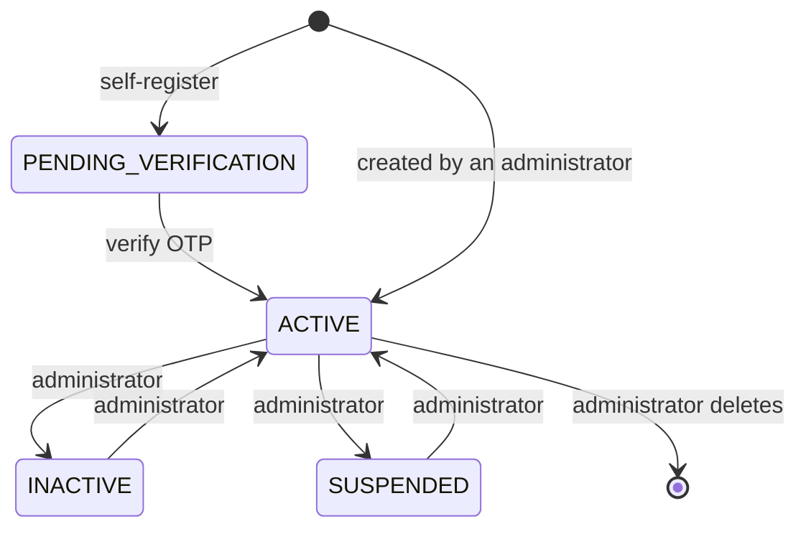
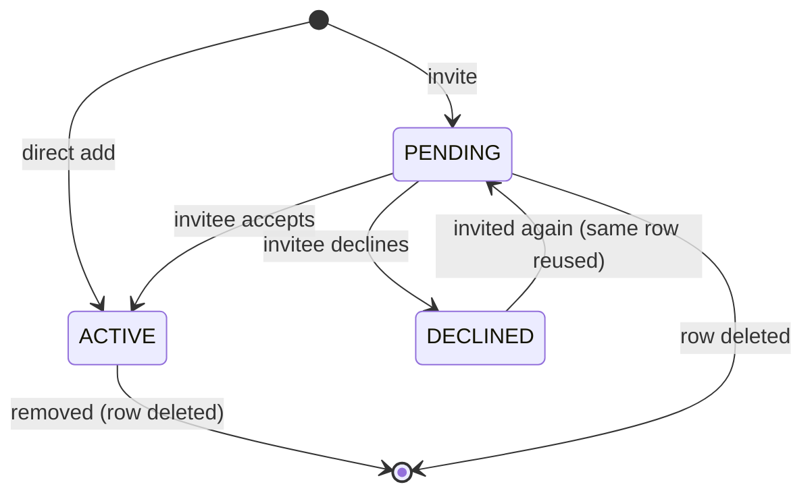

# User & Project Management

Users, projects, project membership and the invitation workflow. Code: `UserService`, `ProjectService`, `ProjectMemberService`, `ProjectAccessGuard`; UI: `pages/Team.jsx`, `pages/Projects.jsx`, `pages/ProjectDetail.jsx`, `components/NewProjectModal.jsx`, `AddProjectMemberModal.jsx`, `AddMemberModal.jsx`. Permission rules are summarized in [authentication-authorization.md](authentication-authorization.md#52-permission-matrix).

## 1. User lifecycle

| Stage | How | Notes |
|---|---|---|
| Create (self) | `POST /api/auth/register` → `POST /api/auth/verify-otp` | Gets the global `USER` role; `fullName` = username until edited. See [authentication-authorization.md](authentication-authorization.md#12-self-registration-with-email-verification) |
| Create (administrator) | `POST /api/users` (UI: Team → *Invite Member*) | The administrator sets a temporary password that must satisfy the [password policy](authentication-authorization.md#4-password-policy); optional role, position, department, status (default `ACTIVE`). The success message says to "share their temporary password to sign in" — no email is sent to the new user |
| Profile | `PUT /api/users/me` | Editable by the user: full name, email, gender, date of birth, phone. **Not** editable by the user: username, role, status, position, department |
| Photo | `PUT /api/users/me/photo` (multipart `file`), `DELETE /api/users/me/photo` | JPEG, PNG, WEBP or GIF only; max 5 MB (`spring.servlet.multipart`); stored as bytes in `users.profile_photo`; served publicly at `/api/photos/{token}` (see [ADR-0009](adr/0009-profile-photos-in-database.md)) |
| Preferences | `PUT /api/users/me/preferences` | `themePreference` (`LIGHT`/`DARK`/`SYSTEM`) and `taskNotificationsEnabled`. **Turning notifications off also stops invitation notifications** — see [notifications.md](notifications.md#5-the-preference-switch) |
| Position / department | `PUT /api/users/{id}/position-department` | By a "team admin" for that user; never by or for yourself. Lists are org-wide (`positions`, `departments`; names unique case-insensitively) |
| Change status / edit | `PUT /api/users/{id}` (administrator) | Full replace of the fields in `UserUpdateRequest` including `username`. Setting a non-`ACTIVE` status is refused while the user is the **sole active owner** of any project |
| Delete | `DELETE /api/users/{id}` (administrator) | Refused while the user is a sole active owner. Database cascades remove their memberships, comments, assignments, notifications and OTP rows; `tasks.created_by`, `subtasks.assignee_id` and `activity_logs.user_id` become NULL. `projects.manager_id` is `ON DELETE RESTRICT`, so deleting a user who is still a project's manager fails at the database |

There is **no UI** for an administrator to edit, deactivate or delete an existing user, or to manage roles — those exist only as API endpoints. The Team page lists users the caller can see and lets team admins set position/department and manage a member's project membership.

The user directory (`GET /api/users`) is scoped: an administrator sees everyone; everyone else sees themselves plus people who share an *active* project with them. A brand-new account with no projects sees only itself. **Single-user lookups follow the same rule** (`GET /api/users/{id}` and `/api/users/username/{username}`): you can read an account's profile only if you are an administrator, it is you, or you share an active project with them; otherwise the answer is the same `404` as for a user that does not exist, so the lookup neither exposes profiles nor confirms that an account exists.

## 2. Projects

### 2.1 Fields (`projects` table, `ProjectRequest` / `ProjectResponse`)

| Field | Rules |
|---|---|
| `projectCode` | **Generated by the server** on create: the next `PRJ-####` after the highest existing `PRJ-` code (`ProjectService.generateProjectCode`; the seed data uses `PRJ-2001`…`PRJ-2010`). The request field is optional; if a code is supplied it is trimmed, must be ≤ 30 characters and unique (`409 "Project code already exists."`). A blank value on create means "generate"; on update it means "keep the current code". The UI never asks for one, and shows it read-only on Edit |
| `name` | required, ≤ 200 |
| `description` | optional text |
| `startDate`, `endDate` | both required; `endDate` ≥ `startDate` (form, plus a database `CHECK`) |
| `managerId` | optional. The caller becomes manager; only a system administrator can name someone else (others' value is ignored) |
| `priority` | `LOW`, `MEDIUM`, `HIGH`, `CRITICAL` (default `MEDIUM`) |
| `status` | `PLANNING` (default), `IN_PROGRESS`, `ON_HOLD`, `COMPLETED`, `CANCELLED` |
| `progress` | **Derived** — see below; any value sent is overwritten by the database |
| `createdAt`, `updatedAt` | maintained by the database |

**Progress** = `100 × completed tasks ÷ non-cancelled tasks` (0 when there are no tasks), recomputed by triggers whenever a task is created, changed, moved or deleted, and on every direct update of the project row (`fn_compute_project_progress`, `trg_tasks_progress_sync`, `trg_projects_progress_derived`).

### 2.2 Lifecycle and operations

| Operation | Endpoint | Who | Behaviour |
|---|---|---|---|
| Create | `POST /api/projects` | any authenticated user | Creator becomes manager **and** an active `OWNER` member (`ensureManagerIsMember`). UI sends `status: PLANNING`, `progress: 0` |
| List | `GET /api/projects` | any authenticated user | Administrator: all. Others: projects where they are an **active** member |
| Read | `GET /api/projects/{id}` | active member / administrator | `404` for non-members |
| Update | `PUT /api/projects/{id}` | `OWNER` / `ADMIN` / administrator | Full replace. UI: Edit dialog (name, description, dates, priority; manager dropdown for administrators) and an inline status dropdown on the project page |
| Delete | `DELETE /api/projects/{id}` | `OWNER` / administrator | Database cascades delete the project's members, milestones, tasks and everything under them |

Observations:

- **No rule links project status to its tasks.** Nothing prevents setting a project to `COMPLETED` while tasks are open, and `projects` has no completion-date column (only `tasks.completed_at` exists). *(Confirmed by reading `ProjectService` and the schema.)*
- The Projects page search matches the project **name and description** only (not code, manager or status). There are no status/priority filters on the project list.
- The card list sorts fully complete (100%) projects to the bottom.
- The Projects page subtitle reads "N active projects" but counts every project the caller can see.

## 3. Project membership

`project_members` — one row per (project, user) (`UNIQUE (project_id, user_id)`):

| Column | Meaning |
|---|---|
| `project_role` | `OWNER`, `ADMIN`, `MEMBER` (default), `VIEWER` |
| `status` | `PENDING`, `ACTIVE` (default), `DECLINED` |
| `invited_by` | who sent the invitation (NULL for direct adds / deleted users) |
| `responded_at` | when the invitee accepted or declined |
| `joined_at` | row creation time |

Two ways a row appears:

1. **Direct add** — `POST /api/project-members` (`OWNER`/`ADMIN`). Becomes `ACTIVE` immediately. Used internally when a project is created (the creator → `OWNER`). Granting `OWNER` requires being an owner. Inactive/suspended users are refused.
2. **Invitation** — see below.

Other operations: `PUT /api/project-members/{id}` (change role), `DELETE /api/project-members/{id}` (remove; blocked if it would remove the last active owner). In the UI, **removal** is on the Team page (an ✕ beside a project in a member's list). **Role changes have no UI.**

Reads: `GET /api/project-members` and `GET /api/project-members/project/{id}` return **active** members only; `GET /api/project-members/{id}` requires access to that row's project; `GET /api/project-members/user/{userId}` is **scoped**: an administrator gets every row, anyone else only the user's *active* memberships in projects the caller also belongs to. `PUT /api/project-members/{id}` can change only the **role** — the row's project and user cannot be re-pointed (`400`).

## 4. Invitations

### 4.1 State machine

There is no separate invitation table: a project is the team, and an invitation is simply a `project_members` row that is not yet `ACTIVE` ([ADR-0003](adr/0003-project-membership-and-invitations.md)).

### 4.2 Sending an invitation — `POST /api/project-members/invite`

Request: `{ "projectId": 1, "username": "newuser" }` → `201` with a `ProjectMemberResponse` (`status: PENDING`, `projectRole: MEMBER`).

Rules, in order (`ProjectMemberService.inviteMember`):

1. Caller must be `OWNER`/`ADMIN` of the project, or a system administrator (`403`).
2. The target is looked up by **username, case-insensitive, exact match** — partial names and emails do not match (`404 "No user found with that username"`).
3. You cannot invite yourself (`400 "You cannot invite yourself"`).
4. The target account must be `ACTIVE` (`400 "<username> has an inactive account and can't be added to a project"`) — this covers `INACTIVE`, `SUSPENDED` and `PENDING_VERIFICATION`.
5. If a row already exists: `ACTIVE` → `400 "…is already a member of this team"`; `PENDING` → `400 "An invitation is already pending for …"`; `DECLINED` → the row is reused and set back to `PENDING`.
6. A `TEAM_INVITATION` notification is created for the invitee (unless they turned notifications off).

Invitees always join as `MEMBER`. The invitation request has no role field.

### 4.3 Accepting or declining

`POST /api/project-members/project/{projectId}/accept` and `…/decline` — callable only for **your own** pending row (resolved from the token; `404 "No invitation found"`, or `400 "This invitation is no longer pending"`). Accepting sets `ACTIVE`; declining sets `DECLINED`. Either stamps `responded_at` and notifies the inviter (`TEAM_INVITATION_RESPONDED`).

**In the UI** the only place to respond is the **notification bell** in the top bar: a `TEAM_INVITATION` notification shows **Accept** and **Decline** buttons (`layout/TopBar.jsx`). The inviter sees the response as a notification.

Consequences:

- The invitation is surfaced to the invitee **only through that notification**. If the invitee has turned task notifications off, no notification is created and the UI offers no other way to accept — the row stays `PENDING` until someone uses the API. *(Derived from `NotificationService.notifyTeamInvitation` and the UI code.)*
- Notifications are fetched at page load and after the user's own actions; a freshly sent invitation appears after the invitee's next reload.
- A `PENDING` or `DECLINED` row grants no access, no task assignment, and does not appear in member lists.

### 4.4 Pending invitations

| Need | Endpoint | Who |
|---|---|---|
| Count | `GET /api/project-members/project/{id}/invitations/count` → `{ "count": n }` | `OWNER`/`ADMIN`/administrator |
| List | `GET /api/project-members/project/{id}/invitations` → `ProjectMemberResponse[]` (status `PENDING`) | same |

The count comes from a database count of `PENDING` rows (`ProjectMemberRepository.countByProjectIdAndStatus`), not from the (active-only) members list. The project page shows "**N pending invitation(s)**" under the member list **to managers only**. Nothing in the UI lists or cancels pending invitations — cancelling would need `DELETE /api/project-members/{id}` with the row id from the list endpoint. The seed data contains pending invitations (for example `dev.tomas` on `PRJ-2001`).

## 5. Entry points in the UI

| Where | What it does |
|---|---|
| Project page → Members → **Add member** (managers only) | Opens `AddProjectMemberModal`: type or pick a username (suggestions are searched as you type), **Send Invitation** → `POST /api/project-members/invite` |
| Team page → select a member → **Invite to team** | Picks a project the caller administers and calls the same endpoint for the selected member. Hidden, with an explanatory note, when the member is not `ACTIVE` |
| Top bar bell | Accept / Decline an invitation you received |
| Team page → ✕ beside a project | Remove that member from the project |

## 6. Member search and eligibility

`GET /api/project-members/project/{projectId}/invitable-users?q=<text>&limit=<n>` (managers only) powers the picker.

**Eligible = all of:** the account is `ACTIVE`; it is not the caller; it has no `ACTIVE` or `PENDING` membership on this project (a `DECLINED` user *is* eligible again).

**Matching:** case-insensitive substring on `username` **or** `fullName`; `%` and `_` typed by the user are matched literally (escaped). Results are ordered by full name, **filtered and limited in the database** (`UserRepository.findInvitableUsers`), default 10, clamped to 1–20. Users are found **even if they share no project** with the caller. The response is a narrow DTO — `id`, `fullName`, `username`, `positionName`, `profilePhotoUrl` (no email, phone or date of birth).

**Enforcement is separate from the suggestions:** the backend rejects ineligible targets in `inviteMember` and `createProjectMember` regardless of what the UI offered, so typing a username that was not suggested still goes through the same checks.

UI behaviour (`AddProjectMemberModal`): input with a `<datalist>`; suggestions refresh 250 ms after typing stops; a failed lookup silently keeps the previous list and manual entry still works. Matching by name relies on the browser's datalist filtering behaviour (**Needs clarification** across browsers — the server returns name matches; whether a given browser shows them is browser-dependent).
